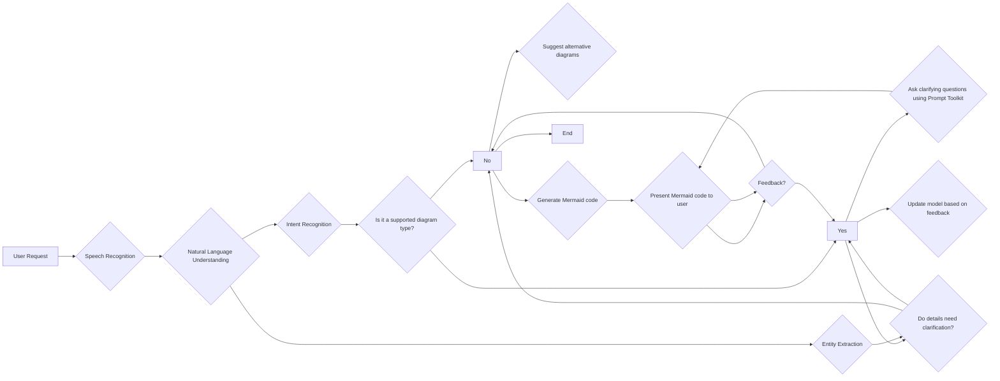

## Building an AI for Generating Diagrams from Descriptions

This document outlines a plan to build a Python AI product that can generate Mermaid code based on spoken or written descriptions of processes, diagrams, or projects.  

### Core Functionality

The core functionality focuses on:

1. **User Input:** Accepting spoken English descriptions (optional) or written text descriptions.
2. **Natural Language Understanding (NLU):** 
    * Identifying the type of diagram the user wants (e.g., flowchart, UML class diagram).
    * Extracting crucial details from the description like steps in a process or system components.
3. **Mermaid Code Generation:** Building Mermaid code using the extracted information.
4. **User Interaction:**
    * Asking clarifying questions if the information seems insufficient.
    * Presenting the generated Mermaid code for user feedback.
    * Refining the model based on user feedback.

### Tools and Technologies

* **Python:** As the primary programming language.
* **Hugging Face Transformers:** Leverage pre-trained models for NLU tasks.
    * Consider `DistilBERT` or `T5` for intent recognition and summarization.
* **SpeechRecognition (Optional):** For converting spoken English to text.
* **Mermaid library:** To interact with the Mermaid diagramming language.
* **Prompt Toolkit (Optional):** To handle user interaction and prompt for clarification.

### Advantages

* **Focus:** The solution is laser-focused on generating Mermaid code from user descriptions.
* **Open Source:** Utilizes open-source libraries for cost-effectiveness and flexibility.
* **Customization:**  Can be fine-tuned to support specific diagram types.

### Getting Started

1. **Choose a Hugging Face Transformer:** Select a pre-trained model for NLU tasks based on your needs.
2. **Develop Core Functionality:** 
    * Implement user input handling (text or speech).
    * Integrate the chosen model for NLU.
    * Build functionalities for Mermaid code generation and user interaction.
3. **Training Data:** Create a focused dataset of spoken English descriptions paired with corresponding Mermaid code for the specific diagram types you want to support.
4. **Feedback and Refinement:**  Implement a loop to gather user feedback and refine the model based on corrections.

### Resources

* Hugging Face Transformers: [https://huggingface.co/docs/transformers/index](https://huggingface.co/docs/transformers/index)
* SpeechRecognition: [https://pypi.org/project/SpeechRecognition/](https://pypi.org/project/SpeechRecognition/)
* Mermaid: [https://github.com/mermaid-js/mermaid](https://github.com/mermaid-js/mermaid)
* Prompt Toolkit: [https://python-prompt-toolkit.readthedocs.io/](https://python-prompt-toolkit.readthedocs.io/)
* GloVe Word Embeddings: [https://nlp.stanford.edu/pubs/glove.pdf](https://nlp.stanford.edu/pubs/glove.pdf)
* Word2Vec: [https://en.wikipedia.org/wiki/Word2vec](https://en.wikipedia.org/wiki/Word2vec)

### Next Steps

* Start with a Minimal Viable Product (MVP) focusing on core functionalities.
* Gradually add features like speech recognition and user suggestions.
* Continuously improve the model's accuracy through user feedback and data augmentation.

This plan provides a roadmap to build your AI tool. Remember, this is an iterative process, so be prepared to adapt and refine your approach based on testing and user experience.

**Mermaid Flowchart**

