# Collection of Broken Mermaid Diagrams

This document contains 25 intentionally incorrect or broken Mermaid diagrams for testing and training purposes. Each diagram has one or more errors that prevent it from rendering correctly.

## Diagram 1 - Flowchart with Missing Arrow
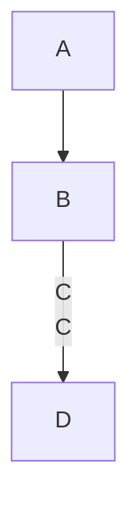

## Diagram 2 - Sequence Diagram with Incorrect Syntax - Semicolon after `sequenceDiagram`
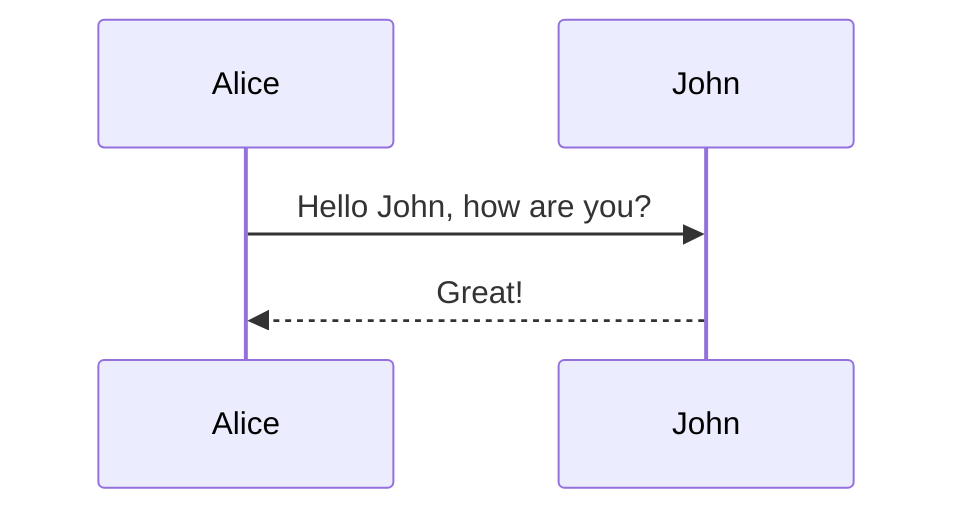

## Diagram 3 - Gantt Chart with Mismatched Dates
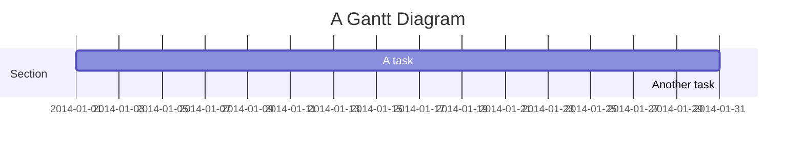

## Diagram 4 - Pie Chart with Missing Values


## Diagram 5 - Class Diagram with Undefined Classes
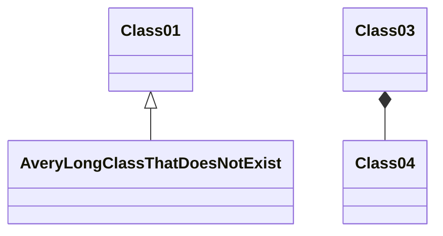

## Diagram 6 - State Diagram with Invalid Transitions
```mermaid
stateDiagram-v2
    [*] --> State1
    State1 --> State2
    State2 --> State3
    State3 -!-> [*]
```

## Diagram 7 - ER Diagram with Syntax Errors
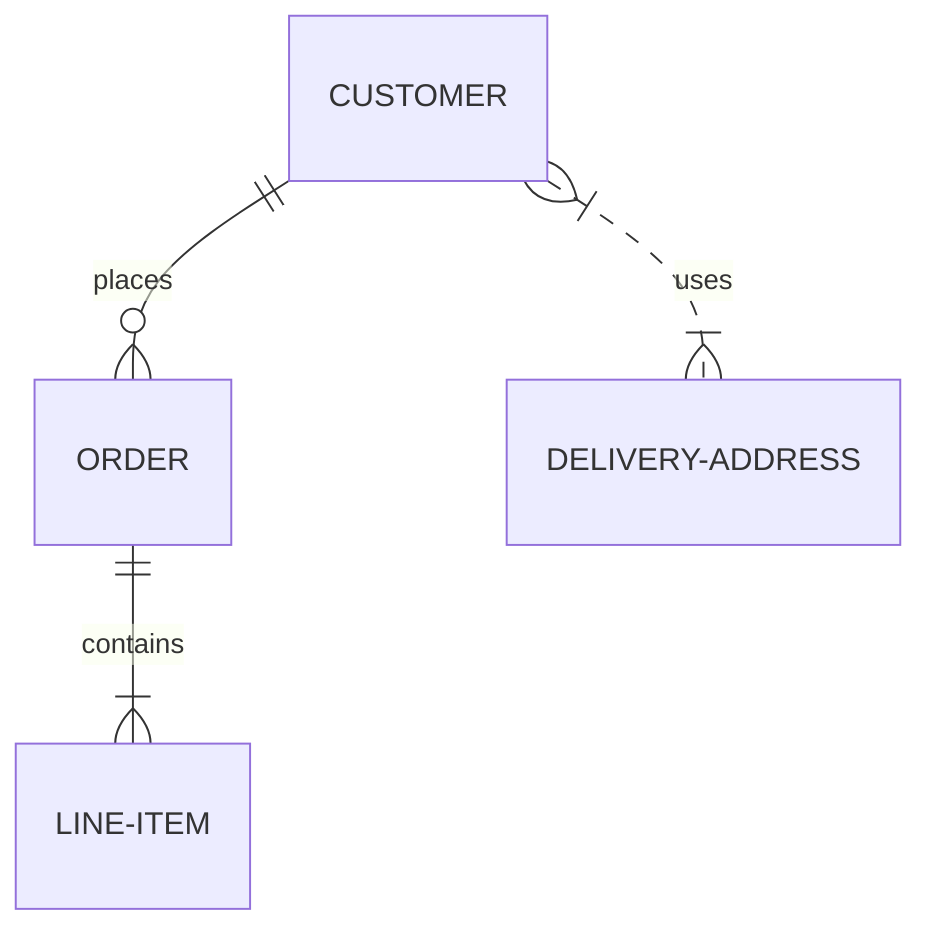

## Diagram 8 - Flowchart with Undefined Node
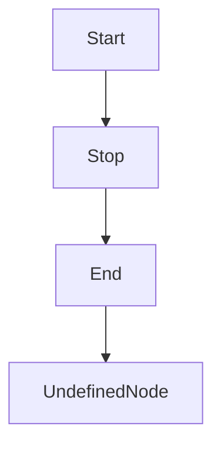

## Diagram 9 - Sequence Diagram with Missing Participant
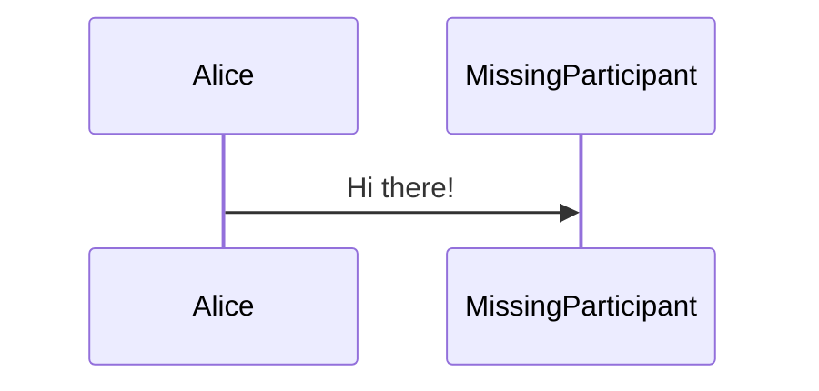

## Diagram 10 - Gantt Chart with Overlapping Tasks
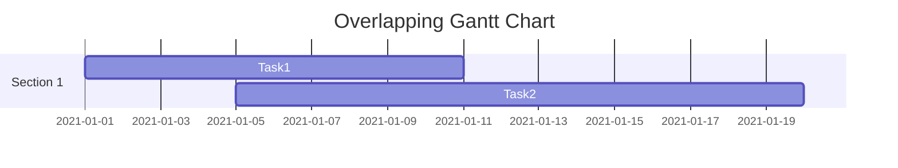

## Diagram 11 - Pie Chart with Incorrect Labels


## Diagram 12 - Class Diagram with Circular Inheritance
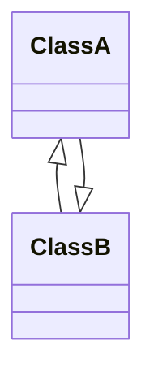

## Diagram 13 - State Diagram with Non-existent State
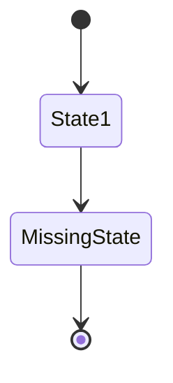

## Diagram 14 - ER Diagram with Inconsistent Cardinality
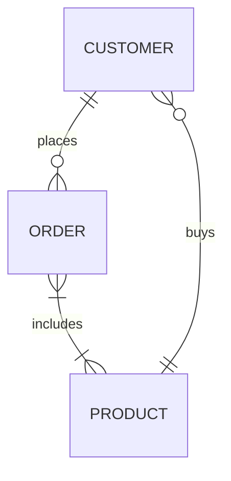

## Diagram 15 - Flowchart with Incoherent Flow
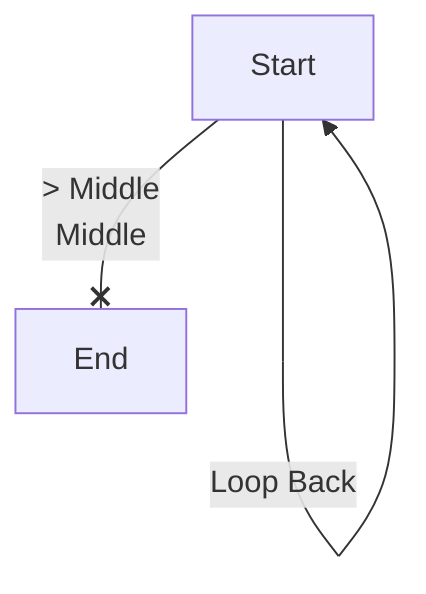