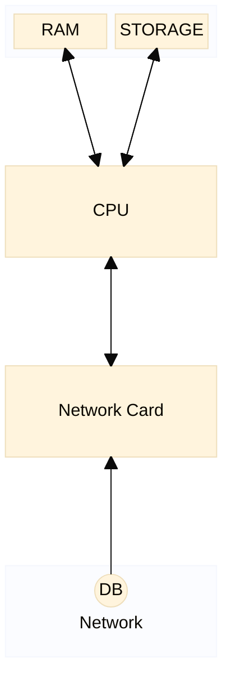

# NLP Task Description

### Diagram Type: Block Diagram

### Task: Hardware Component Visualization

This task involves creating a block diagram, as shown in the Mermaid example, to visually represent major
hardware components, including CPU, RAM, Storage, Network Interface Cards (NICs), and connections to the network and systems.

## Data

### Explicit Data Description

The block diagram will depict major hardware components such as CPU, RAM,
Storage, Network Interface Cards (NICs), and connections to the network and
systems. Note that the raw data example may not be a complete list of all
possible components. Each block represents a component, and lines show
connectivity and data flow.

### Raw Data

```csv
Component,Connections
RAM,"CPU"
CPU,"RAM, STORAGE, NIC"
STORAGE,"CPU"
NIC,"CPU, DB"
DB,"NIC"
```

## Validation & Scoring Criteria

### Expected Result:

- **Structure:** A block diagram illustrating major hardware components and their connections.
- **Labels:** Components labeled appropriately, and connections between components clearly represented.
- **Semantic Accuracy:** Correct representation of component connectivity based on the raw data.
- **Completeness:** All major hardware components and connections should be included in the diagram.
- **Additional Notes:** The diagram should provide a clear overview of the hardware architecture and data flow.

**Mermaid Example:**



### Scoring Weights:

- **Component Matching:** 40%
- **Syntax Correctness:** 20%
- **Semantic Accuracy:** 30%
- **Completeness:** 10%
- **Extra Elements:** Deduct 5 points for each component or connection listed
  in the raw data that does not appear in the generated diagram.
- **Additional Notes:**

## User Requested Data Descriptions

### Data Description 1

**Actor:** Hardware Engineer
**Request:** I need a block diagram that visually represents our computer system's hardware architecture, similar to the provided Mermaid diagram example.

The hardware engineer requests a block diagram to visualize the major hardware components and their connections within a computer system.

**Clarifying Questions:**

1. Are there any additional hardware components or connections not listed in the provided raw data?
2. Should the block diagram include any annotations or labels to provide additional information about the components?
3. How should the connections between components be represented in the diagram?
4. Are there any specific formatting preferences or conventions for the layout of the block diagram?
5. Are there any particular aspects of the hardware architecture that should be highlighted or emphasized in the diagram?

### Data Description 2

**Actor:** System Administrator
**Request:** Please provide a block diagram that outlines the server hardware layout and connectivity, as illustrated in the Mermaid diagram example.

The system administrator requests a block diagram to understand the hardware layout and connectivity within a server environment.

**Clarifying Questions:**

1. How many servers or hardware nodes should be included in the block diagram?
2. Should the diagram represent physical connections or logical connections between hardware components?
3. Are there any specific requirements for depicting redundancy or failover configurations in the diagram?
4. Should the block diagram include any performance metrics or capacity information for the hardware components?
5. Are there any security considerations or network segmentation requirements that should be reflected in the diagram?

### Data Description 3

**Actor:** Software Developer
**Request:** I require a block diagram that helps me understand the hardware infrastructure impacting software performance, akin to the Mermaid diagram shown.

The software developer requests a block diagram to gain insights into the underlying hardware infrastructure for optimizing software performance.

**Clarifying Questions:**

1. Are there any specific hardware components or subsystems that significantly impact software performance?
2. Should the block diagram include any information about virtualized or cloud-based hardware resources?
3. Are there any specific software applications or workloads that the hardware architecture needs to support?
4. Should the diagram include any details about data flow or communication patterns between software and hardware components?
5. Are there any preferences for the level of detail or granularity in the representation of hardware components in the diagram?

### Data Description 4

**Actor:** Network Engineer
**Request:** I'm looking for a block diagram that details our network infrastructure's hardware components and their interconnections, as per the Mermaid diagram example.

The network engineer requests a block diagram to understand the network infrastructure's hardware components and their interconnections.

**Clarifying Questions:**

1. Are there any specific networking devices or equipment that should be included in the block diagram?
2. Should the diagram include information about network protocols or communication standards?
3. Are there any requirements for representing network segmentation or VLAN configurations?
4. Should the block diagram include any details about network bandwidth or throughput requirements?
5. Are there any preferences for the layout or organization of the network components in the diagram?

### Data Description 5

**Actor:** Project Manager
**Request:** I need a block diagram that captures the hardware architecture for our project, consistent with the Mermaid diagram example.

The project manager requests a block diagram to visualize the hardware architecture for planning and resource allocation purposes.

**Clarifying Questions:**

1. Are there any specific project milestones or deadlines that the block diagram should align with?
2. Should the diagram include any information about hardware procurement or lifecycle management?
3. Are there any regulatory or compliance requirements that should be considered in the diagram?
4. Should the block diagram include any information about disaster recovery or business continuity planning?
5. Are there any preferences for the level of detail or abstraction in the representation of hardware components in the diagram?
### Glossary
**Block Diagram:** A visual representation of systems, their components, and connections.
**CPU:** Central Processing Unit, the primary component of a computer that performs most of the processing inside a computer.
**RAM:** Random Access Memory, a type of computer memory that can be accessed randomly.
**Storage:** Devices or media that store digital data.
**NIC:** Network Interface Card, a computer hardware component that connects a computer to a computer network.
