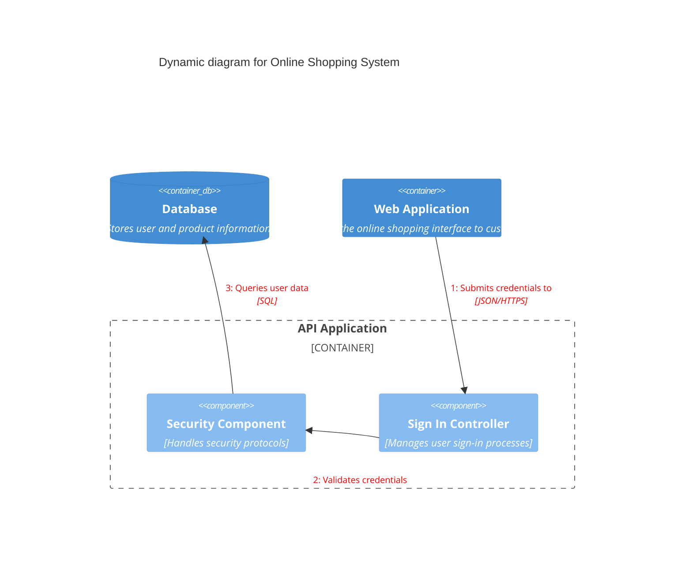

# NLP Task Description

### Diagram Type: C4 Model Diagram
### Task: Software System Architecture
This task involves creating a C4 Model Diagram to represent the software architecture of a typical online shopping system. This model will outline the software components, their relationships, and interactions with external systems.

## Data
### Explicit Data Description
The C4 Model will include four levels of abstraction: Context, Containers, Components, and Code. The Context diagram will show the overall system and its interactions with users and external systems. The Container diagram will break down the system into web applications, databases, and services. The Component diagram will delve deeper into the architecture of a specific container, like the web application. The Code level will illustrate some specific classes or code structures.

### Raw Data

```csv
Level,Description
Context,"System, Users, External Interfaces"
Container,"Web App, Mobile App, Database, API Services"
Component,"Shopping Cart, User Profile, Payment Interface"
Code,"Classes and Methods for Payment Processing"
```

## Validation & Scoring Criteria

### Expected Result:
- **Structure:** The diagram should clearly depict the different abstraction layers of the system.
- **Labels:** Each element within the layers should be appropriately labeled with its role or function.
- **Semantic Accuracy:** The relationships and data flows between the elements must correctly represent the actual software architecture.
- **Completeness:** The diagram should cover all principal components and their
  interactions within the system.
- **Extra Elements:** Deduct 5 points for each component or connection listed
  in the raw data that does not appear in the generated diagram.
- **Additional Notes:**
- **Additional Notes:** Use color coding or different shapes to distinguish between different types of elements (e.g., databases, services, user interfaces).

**Mermaid Example:**



### Scoring Weights:
- **Component Matching:** 40%
- **Syntax Correctness:** 20%
- **Semantic Accuracy:** 30%
- **Completeness:** 10%
- **Extra Elements:** Deduct 5 points for each unnecessary element.

## User-Requested Data Descriptions

### Data Description 1
**Actor:** Software Architect
"I use the C4 model to understand and document the high-level architecture of our online shopping platform, focusing on system interactions, user access methods, and integration with external services."

**Clarifying Questions:**
1. "Can you specify the external systems that the platform interacts with?"
2. "How is user authentication handled across the system?"
3. "What are the main components of the API services?"
4. "What security measures are in place for data transactions?"
5. "How are updates to the mobile app distributed and managed?"

### Data Description 2
**Actor:** Developer
"For the development of the online shopping system, I focus on the Component diagram where detailed architectures of the shopping cart, user profile management, and payment processing are outlined."

**Clarifying Questions:**
1. "What technologies are used in the shopping cart's implementation?"
2. "How is the user profile data structured and secured?"
3. "Can you provide details on the payment processing workflow?"
4. "Are there any performance bottlenecks in the current component setup?"
5. "How do we handle scalability in component services?"

### Data Description 3
**Actor:** Systems Analyst
"I analyze the Container diagram to understand how the web application, mobile app, and database are architecturally aligned and interact with each other within our online shopping system."

**Clarifying Questions:**
1. "What database solutions are we using, and how are they accessed by the apps?"
2. "How do the web and mobile apps maintain session consistency?"
3. "What APIs are available for third-party integrations?"
4. "Is there a container orchestration platform in use?"
5. "How are the containers monitored for health and performance?"

### Data Description 4
**Actor:** Product Manager
"The C4 model helps in planning product features by understanding the software's architecture and how different components like the payment systems and user interfaces interact to deliver a seamless shopping experience."

**Clarifying Questions:**
1. "Which features are planned for the next release of the system?"
2. "How does the architecture support new payment methods?"
3. "What user feedback mechanisms are integrated into the system?"
4. "How is feature prioritization influenced by architectural constraints?"
5. "What are the compliance considerations for new features?"

### Data Description 5
**Actor:** QA Engineer
"My focus is on the Code level, where I need to ensure that all classes and methods for processes like payment and user management are thoroughly tested and meet our quality standards."

**Clarifying Questions:**
1. "What specific classes are involved in payment processing?"
2. "How are the test cases designed for these classes?"
3. "What automation tools are used for testing these components?"
4. "Are there any known issues with the current implementations?"
5. "What metrics are used to measure code quality and performance?"

This comprehensive C4 model description, along with targeted clarifying questions, ensures a deep understanding of the system architecture from multiple perspectives, aiding in better design, development, testing, and management of the software.
