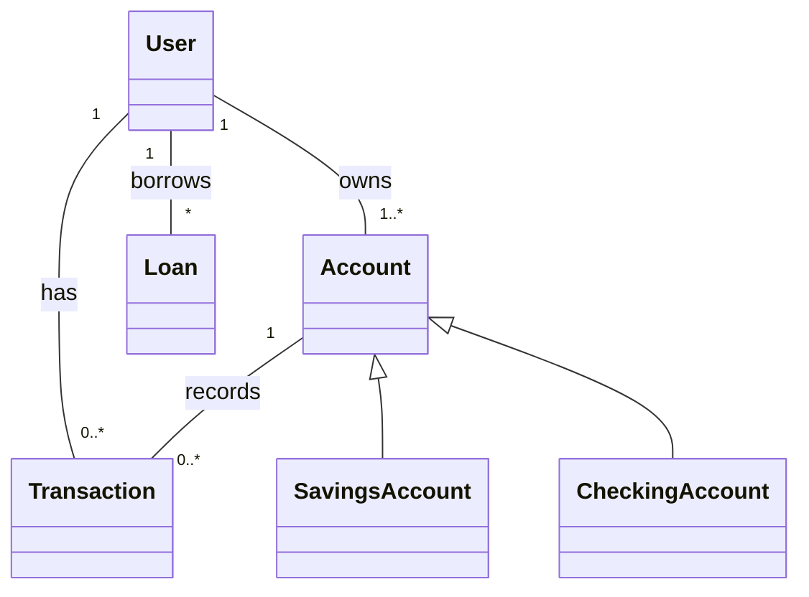

# NLP Task Description

### Diagram Type: Class Diagram
### Task: Online Banking System
This task involves creating a Class Diagram for an online banking system. The diagram will outline the classes, their attributes, methods, and the relationships between them, such as inheritance and associations.

## Data
### Explicit Data Description
The class diagram will include classes such as Account, User, Transaction, and Loan. Relationships like inheritance (e.g., SavingsAccount and CheckingAccount inheriting from Account) and associations (e.g., User having multiple Transactions) will be detailed.

### Raw Data

```csv
Class,Attributes,Methods,Relationships
User,"UserID, Name, Address","Login(), Logout(), UpdateProfile()",Has many Transactions
Account,"AccountNumber, Balance","Deposit(amount), Withdraw(amount)",Inherited by SavingsAccount, CheckingAccount
Transaction,"TransactionID, Date, Amount","Execute()",Belongs to Account
Loan,"LoanID, LoanAmount, InterestRate","CalculateInterest()",Owned by User
```

## Validation & Scoring Criteria

### Expected Result:
- **Structure:** The diagram should clearly depict the classes and their relationships.
- **Labels:** Each class should be labeled with its name, attributes, and methods.
- **Semantic Accuracy:** Relationships like inheritance and associations should be accurately represented.
- **Completeness:** The diagram should include all critical components
  necessary for an online banking system.
- **Extra Elements:** Deduct 5 points for each component or connection listed
  in the raw data that does not appear in the generated diagram.
- **Additional Notes:** Use UML notation correctly to enhance clarity and understanding.

**Mermaid Example:**



### Scoring Weights:
- **Component Matching:** 40%
- **Syntax Correctness:** 20%
- **Semantic Accuracy:** 30%
- **Completeness:** 10%
- **Extra Elements:** Deduct 5 points for each unnecessary element.

## User-Requested Data Descriptions

### Data Description 1
**Actor:** Software Engineer
"I'm focusing on defining classes and their methods for our online banking application, ensuring that all operations such as deposits, withdrawals, and loan management are encapsulated within appropriate classes."

**Clarifying Questions:**
1. "What security measures are implemented in the User class methods?"
2. "Are there any specific attributes for the Loan class to support different types of loans?"
3. "How is transaction rollback handled in the Transaction class?"
4. "What logging or auditing functionalities are implemented in these classes?"
5. "Are there any planned extensions or new classes to be added soon?"

### Data Description 2
**Actor:** Systems Architect
"The class diagram is crucial for understanding how different banking entities like users, accounts, and transactions are interconnected and how they interact within the system."

**Clarifying Questions:**
1. "Can you describe the database schema that these classes map to?"
2. "How are inheritance relationships managed in the database?"
3. "What are the performance considerations for methods in the Account class?"
4. "Is there any lazy loading or caching implemented for the User class?"
5. "How are changes to the class diagram communicated to the team?"

### Data Description 3
**Actor:** Business Analyst
"I use the class diagram to ensure that all business rules for transactions and loan processes are correctly implemented in the system's classes and methods."

**Clarifying Questions:**
1. "How are business rules like minimum balance or overdrafts handled in the Account class?"
2. "Are there any specific compliance checks in the Loan class methods?"
3. "What methods are available for fraud detection in transactions?"
4. "How do we ensure data consistency across classes?"
5. "What mechanisms are in place to update business rules in the system?"

### Data Description 4
**Actor:** Quality Assurance Engineer
"My role is to test the methods in each class to ensure they perform as expected under various scenarios, particularly focusing on edge cases and error handling."

**Clarifying Questions:**
1. "What are the test cases for the methods in the User class?"
2. "How are exceptions handled in the Transaction class?"
3. "What is the testing strategy for inheritance in the Account class?"
4. "Are there integration tests that involve multiple classes?"
5. "How is the overall test coverage for the class diagram measured?"

### Data Description 5
**Actor:** Database Administrator
"As a DBA, I ensure that the classes in the diagram efficiently interact with the database, especially regarding how transactions are managed and persisted."

**Clarifying Questions:**
1. "What database transactions are required for operations in the Transaction class?"
2. "How are the classes optimized for database performance?"
3. "Are there any specific locking strategies used in the database schema?"
4. "How are large volume data operations handled in the Account and Transaction classes?"
5. "What backup and recovery processes are associated with these classes?"

This class diagram description is designed to provide a comprehensive understanding of the online banking system's software architecture, facilitating better design, development, and maintenance processes across different roles within the team.
