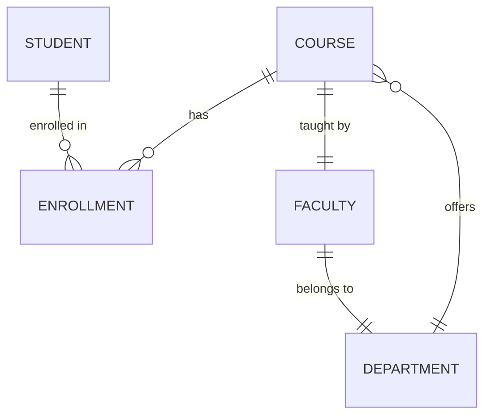

# NLP Task Description

### Diagram Type: Entity Relationship Diagram
### Task: University Database Schema
This task involves creating an Entity Relationship Diagram (ERD) for a university's database system. The diagram will represent the entities, their attributes, and relationships such as student enrollment, faculty, courses, and departments.

## Data
### Explicit Data Description
The ERD will include entities like Student, Course, Faculty, Department, and Enrollment. Key relationships will include Students enrolled in Courses, Faculty teaching Courses, and Courses offered by Departments. Each entity will have relevant attributes like Student (StudentID, Name, Major) and Course (CourseID, Name, Credits).

### Raw Data

```csv
Entity,Attributes,Relationships
Student,"StudentID, Name, Major","Enrolled in Courses"
Course,"CourseID, Name, Credits","Taught by Faculty, Offered by Department"
Faculty,"FacultyID, Name, Department","Teaches Courses"
Department,"DepartmentID, Name","Offers Courses"
Enrollment,"StudentID, CourseID","Links Students and Courses"
```

## Validation & Scoring Criteria

### Expected Result:
- **Structure:** The diagram should clearly depict all entities and their relationships.
- **Labels:** Each entity should be labeled with its name and list of attributes.
- **Semantic Accuracy:** The relationships between entities should accurately reflect the administrative and academic structure of the university.
- **Completeness:** The diagram should include all primary entities and their relationships necessary for the university's database.
- **Additional Notes:** Use standardized ERD notation to ensure clarity and adherence to database design principles.

**Mermaid Example:**



### Scoring Weights:
- **Component Matching:** 40%
- **Syntax Correctness:** 20%
- **Semantic Accuracy:** 30%
- **Completeness:** 10%
- **Extra Elements:** Deduct 5 points for each unnecessary element.

## User-Requested Data Descriptions

### Data Description 1
**Actor:** Database Designer
"I'm creating the ERD to accurately represent how students, courses, faculty, and departments interact within our university's database system."

**Clarifying Questions:**
1. "Are there any specific attributes for students or faculty that need to be included beyond the basics?"
2. "How are joint courses between departments handled in the database?"
3. "What security measures are implemented to protect sensitive student and faculty data?"
4. "Are there any planned expansions or changes in department structures that should be reflected?"
5. "How do we handle historical data for students who have graduated or courses that are no longer offered?"

### Data Description 2
**Actor:** Systems Analyst
"The ERD helps us understand and optimize the relationships and data flows between entities such as students, courses, and faculty, which is critical for our academic reporting and administration."

**Clarifying Questions:**
1. "What are the most common queries run against these entities, and how can the design be optimized for them?"
2. "Are there any performance issues with the current database schema?"
3. "How is redundancy minimized in the relationships between entities?"
4. "What automated processes depend on this ERD, such as enrollment or grading systems?"
5. "How are changes in course prerequisites reflected in the relationships?"

### Data Description 3
**Actor:** Academic Administrator
"I rely on the ERD to ensure that our database accurately represents the academic structure of the university, from course offerings to faculty assignments."

**Clarifying Questions:**
1. "How is faculty workload calculated from the data available in the ERD?"
2. "What provisions are there for handling exceptional cases, such as cross-listed courses or temporary faculty?"
3. "Are there attributes in the entities that help with accreditation processes?"
4. "How do we track student progress through their major as defined by the ERD?"
5. "What are the implications of department mergers or splits on the ERD?"

### Data Description 4
**Actor:** IT Support Specialist
"My focus is ensuring that the database systems based on the ERD are maintained efficiently, with quick access to necessary information and minimal downtime."

**Clarifying Questions:**
1. "What database management system are we using, and how does it impact the ERD?"
2. "How often is the database backed up?"
3. "What are the disaster recovery plans related to the database?"
4. "How is database integrity checked and maintained?"
5. "Are there specific performance metrics we monitor related to the database usage?"

### Data Description 5
**Actor:** Registrar
"The ERD is critical for my role as it defines how student enrollments, course schedules, and faculty assignments are managed and reported throughout the academic year."

**Clarifying Questions:**
1. "How does the ERD support dynamic changes in course schedules and room assignments?"
2. "What data is used from the ERD to fulfill state and federal educational reporting requirements?"
3. "How are student academic holds handled in the system?"
4. "What role does the ERD play in managing graduation requirements and verifications?"
5. "Are there tools integrated with the database for direct data manipulation or visualization?"

These detailed ERD descriptions provide a comprehensive overview that supports various administrative and academic functions within the university, ensuring all stakeholders can effectively utilize and interact with the database.
