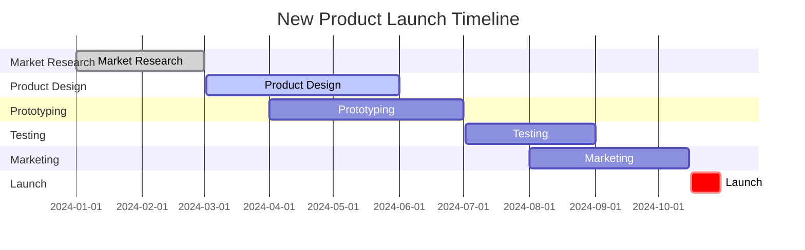

# NLP Task Description

### Diagram Type: Gantt Chart
### Task: New Product Launch Plan
This task involves creating a Gantt Chart for the project management of a new product launch. The chart will display the timeline for all key activities, from initial market research to the official product release.

## Data
### Explicit Data Description
The Gantt Chart will outline major tasks such as Market Research, Product Design, Prototyping, Testing, Marketing, and Launch. Each task will be associated with start dates, end dates, and dependencies, showing the sequence and overlap of activities.

### Raw Data

```csv
Task,Start Date,End Date,Dependencies
Market Research,"2024-01-01","2024-03-01",
Product Design,"2024-03-02","2024-06-01",Market Research
Prototyping,"2024-04-01","2024-07-01",Product Design
Testing,"2024-07-02","2024-09-01",Prototyping
Marketing,"2024-08-01","2024-10-15",Testing
Launch,"2024-10-16","2024-10-30",Marketing
```

## Validation & Scoring Criteria

### Expected Result:
- **Structure:** The chart should clearly illustrate the timeline and sequence of project tasks.
- **Labels:** Each task should be labeled with its name and the duration it covers.
- **Semantic Accuracy:** The dependencies and overlaps between tasks should be correctly represented to reflect true project dynamics.
- **Completeness:** The chart should include all significant tasks required to
  bring the product from concept to market.
- **Extra Elements:** Deduct 5 points for each component or connection listed
  in the raw data that does not appear in the generated diagram.
- **Additional Notes:** Use contrasting colors for different task phases to enhance readability and enable quick visual assessment of project status.

**Mermaid Example:**



### Scoring Weights:
- **Component Matching:** 40%
- **Syntax Correctness:** 20%
- **Semantic Accuracy:** 30%
- **Completeness:** 10%
- **Extra Elements:** Deduct 5 points for each unnecessary element.

## User-Requested Data Descriptions

### Data Description 1
**Actor:** Project Manager
"The Gantt Chart for our new product launch starts with market research, followed by sequential phases of design, prototyping, testing, and marketing, culminating in the launch."

**Clarifying Questions:**
1. "Are there any external dependencies that might affect the schedule of market research?"
2. "What are the key milestones in the product design phase?"
3. "How are delays in prototyping expected to impact testing and subsequent phases?"
4. "What resources are allocated for the marketing phase?"
5. "Are there any contingency plans for delays in the launch phase?"

### Data Description 2
**Actor:** Product Development Team Lead
"We use the Gantt Chart to track progress in product development from design through to prototyping and testing, ensuring each phase begins on time as previous phases conclude."

**Clarifying Questions:**
1. "Can you detail the deliverables for each task listed in the chart?"
2. "What are the critical path items in this project?"
3. "How do changes in the testing phase affect the overall timeline?"
4. "What are the specific roles involved in each task?"
5. "How is progress monitored and reported to stakeholders?"

### Data Description 3
**Actor:** Marketing Director
"The marketing phase in the Gantt Chart must align with testing completion to ensure the product is ready and tested before we begin our promotional activities."

**Clarifying Questions:**
1. "What specific marketing strategies are in place following the testing phase?"
2. "How does the marketing timeline integrate with public relations and advertising campaigns?"
3. "Are there promotional events planned that depend on product readiness?"
4. "How is feedback from testing incorporated into marketing materials?"
5. "What are the backup plans if the product encounters issues during testing?"

### Data Description 4
**Actor:** Quality Assurance Coordinator
"In the testing phase of the Gantt Chart, we ensure that all aspects of the product meet the highest standards before entering the marketing and launch phases."

**Clarifying Questions:**
1. "What testing methods are used to evaluate the product?"
2. "How are test results communicated to the product development team?"
3. "What are the criteria for passing each test?"
4. "How do testing delays affect the overall project timeline?"
5. "What are the quality benchmarks that must be met before proceeding to the marketing phase?"

### Data Description 5
**Actor:** Senior Executive
"The Gantt Chart provides an overview of the entire product launch timeline, allowing us to see how strategic project management aligns with our business objectives."

**Clarifying Questions:**
1. "How does this product launch fit into our broader strategic goals?"
2. "What are the financial implications of each phase of the project?"
3. "How do we adjust the project timeline based on market or competitive changes?"
4. "What are the risks associated with the project timeline?"
5. "How do we ensure that the project remains on budget?"

This Gantt Chart description, enriched with targeted clarifying questions, is designed to provide a comprehensive view of the project timeline, ensuring that all stakeholders are aligned and informed about the key phases and dependencies of the new product launch.
