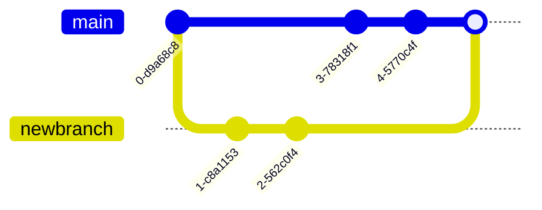

# NLP Task Description

### Diagram Type: Git Graph
### Task: Repository Commit History Visualization
This task involves creating a Git Graph to represent the commit history of a software development project. The graph will display branches, merges, and commits to help visualize the development progress and collaborative efforts.

## Data
### Explicit Data Description
The Git Graph will include nodes representing commits, lines representing branches, and points where lines merge to represent merges between branches. Each node will display the commit ID, the author, and the date of the commit. Branches will be color-coded to distinguish between different development streams. Here is the raw data representation:

```csv
CommitID,Branch,Author,Date,ParentCommitID
c1,master,John Doe,2024-01-01,
c2,master,Jane Smith,2024-01-02,c1
c3,feature-x,John Doe,2024-01-03,c1
c4,master,Jane Smith,2024-01-05,c2
c5,feature-x,John Doe,2024-01-06,c3
c6,master,Jane Smith,2024-01-07,c4
c7,master,John Doe,2024-01-08,c6
c8,feature-x,John Doe,2024-01-09,c5
```

### Raw Data

```csv
CommitID,Branch,Author,Date,ParentCommitID
c1,master,John Doe,2024-01-01,
c2,master,Jane Smith,2024-01-02,c1
c3,feature-x,John Doe,2024-01-03,c1
c4,master,Jane Smith,2024-01-05,c2
c5,feature-x,John Doe,2024-01-06,c3
c6,master,Jane Smith,2024-01-07,c4
c7,master,John Doe,2024-01-08,c6
c8,feature-x,John Doe,2024-01-09,c5
```

## Validation & Scoring Criteria

### Expected Result:
**Structure:** The graph should accurately map the sequence of commits along with their branching and merging points.
**Labels:** Each commit should be labeled with its ID, author, and commit date.
**Semantic Accuracy:** Branches and merges should correctly represent the project's version control history.
**Completeness:** The graph should include all key commits and branches relevant to the project scope.
**Additional Notes:** Use clear, distinct colors or shapes to represent different branches for better visual distinction.

**Mermaid Example:**



### Scoring Weights:
- **Component Matching:** 40%
- **Syntax Correctness:** 20%
- **Semantic Accuracy:** 30%
- **Completeness:** 10%
- **Extra Elements:** Deduct 5 points for each unnecessary element.

## User Requested Data Descriptions

### Data Description 1
**Actor:** Software Developer
"I use the Git Graph to track the progression of features and bug fixes across different branches in our repository."

**Clarifying Questions:**
1. "Can you show where hotfixes are branched and merged back into the main line?"
2. "How are release tags displayed in the graph?"
3. "Is there a way to highlight commits that resolve conflicts?"
4. "Can we filter the graph to show only merges?"
5. "How do you represent reverted commits in the graph?"

### Data Description 2
**Actor:** Project Manager
"The Git Graph helps me monitor the development team's progress and ensure that milestones align with our timelines."

**Clarifying Questions:**
1. "Can you provide a version of the graph that includes time estimates for each commit?"
2. "How can we visualize the impact of a specific commit across branches?"
3. "Is there an integration with our project management tools to link commits to tasks?"
4. "What does the graph show about branch stability and health?"
5. "Can the graph be exported for presentation in project update meetings?"

### Data Description 3
**Actor:** Quality Assurance Engineer
"I rely on the Git Graph to understand the commit history for testing purposes, particularly to identify changes that need targeted regression testing."

**Clarifying Questions:**
1. "Can the graph show the authors of commits to contact them for clarification?"
2. "How are commits linked to bug reports or feature requests?"
3. "What information is available about the testing of each commit?"
4. "Can we see which commits passed or failed automated builds?"
5. "Is there annotation for commits that introduced bugs?"

### Data Description 4
**Actor:** Release Engineer
"The Git Graph is essential for preparing builds, especially to manage features and fixes that are ready for production."

**Clarifying Questions:**
1. "How do we identify commits that are part of the current release cycle?"
2. "What's the process for handling merge conflicts shown in the graph?"
3. "Can we trace feature branches back to their origin in the main branch?"
4. "Is there a way to annotate commits with deployment status?"
5. "How do we ensure that all relevant commits are included in the build?"

### Data Description 5
**Actor:** DevOps Specialist
"Using the Git Graph, I oversee the continuous integration process, ensuring that commits and branches are integrated smoothly without disrupting the main branch."

**Clarifying Questions:**
1. "What automation tools are integrated with the Git graph for CI/CD processes?"
2. "How is branch health monitored using the graph?"
3. "What metrics are used to evaluate the effectiveness of our branching strategy?"
4. "Can the graph help predict potential integration issues?"
5. "How do we handle fast-forward merges versus squash merges in the graph?"

This detailed description of the Git Graph provides a comprehensive view to support various roles involved in software development, enhancing understanding and collaboration throughout the project lifecycle.
