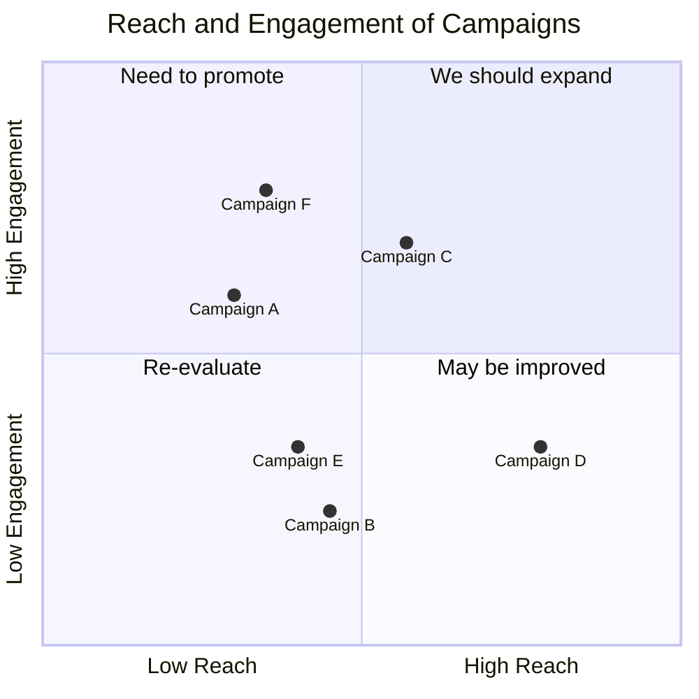

# NLP Task Description

### Diagram Type: Magic Quadrant
### Task: Reach and Engagement Analysis of Marketing Campaigns
This task involves creating a Magic Quadrant to evaluate various marketing campaigns based on their reach and engagement. This tool helps marketing teams to prioritize resources and strategies for different campaigns.

## Data
### Explicit Data Description
The Magic Quadrant will plot marketing campaigns on a graph with two axes: 'Reach' on the x-axis and 'Engagement' on the y-axis. Detailed examples for each campaign include:
1. **Campaign A** - Reach: 0.3, Engagement: 0.6
2. **Campaign B** - Reach: 0.45, Engagement: 0.23
3. **Campaign C** - Reach: 0.57, Engagement: 0.69
4. **Campaign D** - Reach: 0.78, Engagement: 0.34
5. **Campaign E** - Reach: 0.40, Engagement: 0.34
6. **Campaign F** - Reach: 0.35, Engagement: 0.78
Campaigns will be categorized into one of four quadrants: "We should expand," "Need to promote," "Re-evaluate," or "May be improved" based on their scores in these dimensions.

### Raw Data

```csv
Campaign,Reach,Engagement
Campaign A,0.3,0.6
Campaign B,0.45,0.23
Campaign C,0.57,0.69
Campaign D,0.78,0.34
Campaign E,0.40,0.34
Campaign F,0.35,0.78
```

## Validation & Scoring Criteria

### Expected Result:
- **Structure:** The chart should clearly categorize each campaign within the appropriate quadrant.
- **Labels:** Each campaign should be clearly labeled with its position indicated by coordinates, ensuring labels are distinct and easily readable.
- **Semantic Accuracy:** The positioning should accurately reflect the campaigns' reach and engagement data.
- **Completeness:** The chart should include all key campaigns being analyzed.
- **Extra Elements:** Deduct 5 points for each component or connection listed
  in the raw data that does not appear in the generated diagram.
- **Additional Notes:** Use contrasting colors or symbols for each quadrant to enhance readability and differentiate between categories.

**Mermaid Example:**



### Scoring Weights:
- **Component Matching:** 40%
- **Syntax Correctness:** 20%
- **Semantic Accuracy:** 30%
- **Completeness:** 10%
- **Extra Elements:** Deduct 5 points for each unnecessary element.

## User Requested Data Descriptions

### Data Description 1
**Actor:** Marketing Manager
"We use the Magic Quadrant to strategically assess and allocate resources for our marketing campaigns based on their reach and engagement."

**Clarifying Questions:**
1. "How do we define 'Reach' and 'Engagement' for the purposes of this analysis?"
2. "Are there external factors that might skew the reach or engagement scores?"
3. "How frequently is the data updated to reflect current campaign performance?"
4. "What actions are taken for campaigns in the 'Re-evaluate' quadrant?"
5. "How do we track improvements in campaigns moved to a different quadrant?"

### Data Description 2
**Actor:** Data Analyst
"I analyze the positioning of each campaign within the quadrant to provide actionable insights and recommendations for future campaign strategies."

**Clarifying Questions:**
1. "What statistical methods are used to calculate the scores for reach and engagement?"
2. "Can we correlate campaign budget to its quadrant positioning?"
3. "How do competitor campaigns affect our quadrant analysis?"
4. "What is the threshold for a campaign to be considered as having 'High Reach'?"
5. "How do we ensure data integrity and accuracy in this analysis?"

### Data Description 3
**Actor:** Investor
"As an investor, the Magic Quadrant provides a quick overview of which cloud service providers are well-positioned for growth and which are potential risks."

**Clarifying Questions:**
1. "Which quadrant historically leads to the best financial performance?"
2. "What are the key financial metrics that correlate with high scores in execution and vision?"
3. "How do mergers and acquisitions affect a company's position in the quadrant?"
4. "What regulatory challenges could impact the positions of the providers?"
5. "How often are the assessments updated to reflect market changes?"

### Data Description 4
**Actor:** Sales Director
"Using the Magic Quadrant, we can better position our sales pitches by understanding the competitive landscape and highlighting our strengths over others in the same quadrant."

**Clarifying Questions:**
1. "What are the common objections from customers choosing competitors in different quadrants?"
2. "How can we leverage our position in the quadrant during negotiations?"
3. "What are the perceived weaknesses of providers in other quadrants that we can capitalize on?"
4. "How does our sales strategy align with our quadrant position?"
5. "What specific achievements have helped other companies move to a better position?"

### Data Description 5
**Actor:** Customer Success Manager
"The Magic Quadrant is crucial for managing customer perceptions, ensuring they are aware of our strong points and how we compare to other providers in the market."

**Clarifying Questions:**
1. "How do we communicate our quadrant position to customers effectively?"
2. "What are the key factors that customers care about in each quadrant?"
3. "How do changes in our quadrant position affect customer retention?"
4. "What strategies are effective in improving customer perceptions?"
5. "How do competitor improvements in the quadrant impact our customer base?"

This Magic Quadrant description provides a comprehensive view to support various business functions within the industry, ensuring all stakeholders can effectively utilize and interpret the competitive analysis.
