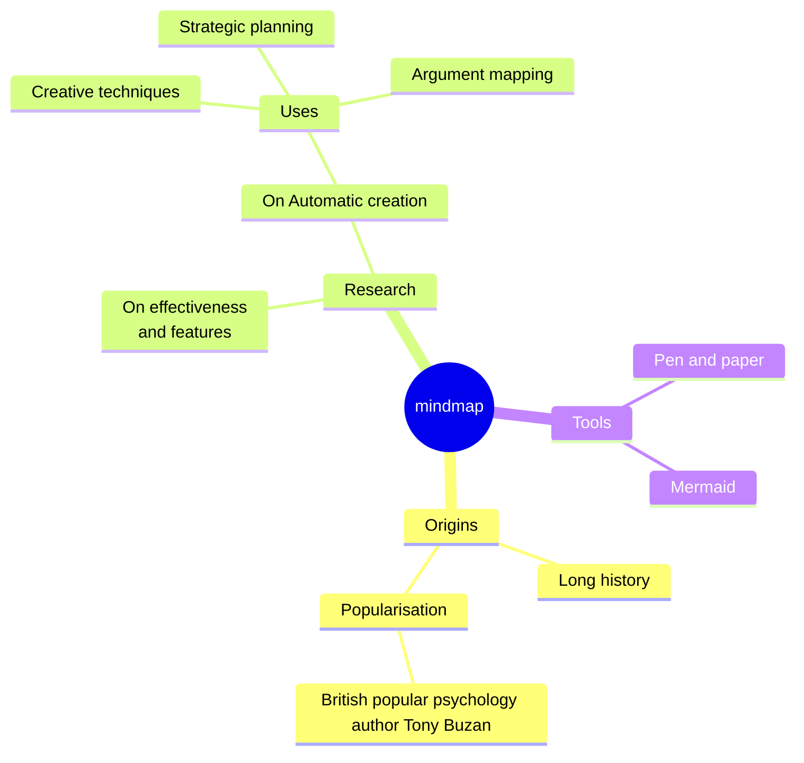

# NLP Task Description

### Diagram Type: Mind Map
### Task: Product Development Ideas for a Tech Startup
This task involves creating a Mind Map to explore and organize different ideas for new product development in a tech startup. The Mind Map will help in brainstorming sessions by visually structuring thoughts, relationships, and potential areas for innovation.

## Data
### Explicit Data Description
The Mind Map will include a central node labeled "New Product Ideas" from which various branches will extend. These branches will represent different categories such as "Software Solutions", "Hardware Innovations", "Service Offerings", and "Research and Development". Each category will further branch out into specific ideas or themes.

### Raw Data

```csv
Category,Idea
Software Solutions,"Cloud Storage Solutions, CRM Software"
Hardware Innovations,"Wearable Tech, Smart Home Devices"
Service Offerings,"IT Consulting, Customer Support"
Research and Development,"AI Algorithms, Quantum Computing"
```

## Validation & Scoring Criteria

### Expected Result:
- **Structure:** The Mind Map should clearly depict all categories and their related ideas.
- **Labels:** Each branch and sub-branch should be clearly labeled with the category or idea name.
- **Semantic Accuracy:** The relationships and hierarchies between ideas should logically reflect potential product development pathways.
- **Completeness:** The Mind Map should encompass a broad spectrum of innovative ideas relevant to the tech industry.
- **Additional Notes:** Use different colors and symbols to represent different categories or levels of priority.

**Mermaid Example:**



### Scoring Weights:
- **Component Matching:** 40%
- **Syntax Correctness:** 20%
- **Semantic Accuracy:** 30%
- **Completeness:** 10%
- **Extra Elements:** Deduct 5 points for each unnecessary element.

## User Requested Data Descriptions

### Data Description 1
**Actor:** Product Manager
"I use the Mind Map to visualize different product development tracks and prioritize areas where we should allocate resources based on market trends and company strengths."

**Clarifying Questions:**
1. "Can we include market analysis data for each product idea?"
2. "How can we link this Mind Map to our project management tools?"
3. "What criteria are used to define the feasibility of each idea?"
4. "Can we integrate customer feedback into the Mind Map?"
5. "How often should the Mind Map be updated to reflect changes in strategy?"

### Data Description 2
**Actor:** Research and Development Lead
"The Mind Map is crucial for identifying and exploring emerging technologies that can be harnessed to create innovative products."

**Clarifying Questions:**
1. "What are the latest trends in AI and quantum computing that can be included?"
2. "How do we track the progress of ideas from concept to prototype?"
3. "Are there collaborative opportunities with academia or industry?"
4. "What are the potential risks associated with each R&D idea?"
5. "How is intellectual property managed for ideas generated from this process?"

### Data Description 3
**Actor:** Marketing Director
"I utilize the Mind Map to align our marketing strategies with the most promising product ideas and ensure that our messaging resonates with target audiences."

**Clarifying Questions:**
1. "Which product ideas have the highest market demand?"
2. "How can we showcase these ideas in upcoming marketing campaigns?"
3. "What are the key selling points for each product category?"
4. "How do competitive products influence our positioning?"
5. "What partnerships can amplify our product launch?"

### Data Description 4
**Actor:** CEO
"The Mind Map provides a strategic overview of potential product avenues, helping guide corporate decisions and long-term planning."

**Clarifying Questions:**
1. "How does each product idea align with our company's mission and vision?"
2. "What is the expected ROI for each category?"
3. "How do these products fit into the global tech ecosystem?"
4. "What are the sustainability considerations for new products?"
5. "What is the timeline for evaluating the success of these ideas?"

### Data Description 5
**Actor:** Innovation Manager
"The Mind Map is a tool for stimulating creative thinking and fostering an innovative culture within the team by visually organizing and expanding upon new ideas."

**Clarifying Questions:**
1. "How can we encourage more team members to contribute to the Mind Map?"
2. "What processes are in place to review and act on these ideas?"
3. "How are innovative ideas rewarded within the company?"
4. "What resources are available for rapid prototyping of ideas?"
5. "How do we measure the impact of these innovations on our business?"

This Mind Map task description provides a comprehensive approach to brainstorming and organizing product development ideas, enhancing strategic planning and innovation within a tech startup environment.
