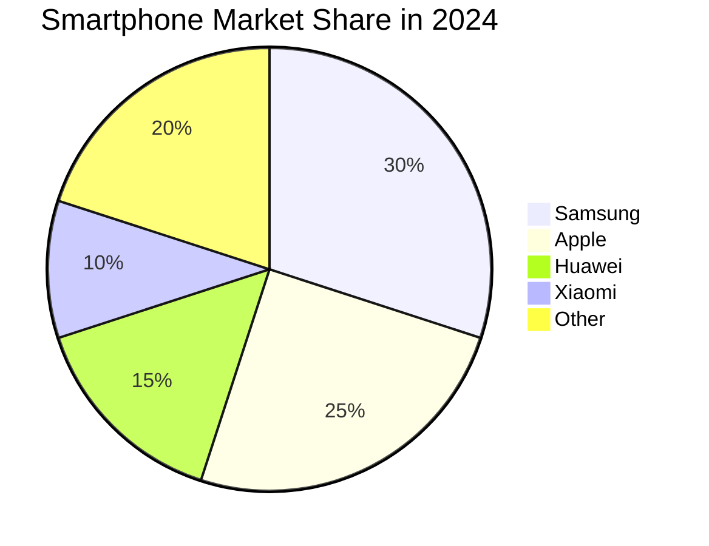

# NLP Task Description

### Diagram Type: Pie Chart
### Task: Smartphone Market Share Analysis
This task involves creating a pie chart that represents the 2024 market share of various smartphone manufacturers. This visual will aid in understanding the competitive landscape and guide strategic decisions for marketing and product development.

## Data
### Explicit Data Description
The pie chart will display the market shares of five major smartphone manufacturers for the year 2024. Here are the details:
1. **Samsung** - Holds 30% of the market share.
2. **Apple** - Holds 25% of the market share.
3. **Huawei** - Holds 15% of the market share.
4. **Xiaomi** - Holds 10% of the market share.
5. **Other** - Represents the remaining 20% of the market share.

### Raw Data

```csv
Manufacturer,Market Share
Samsung,30%
Apple,25%
Huawei,15%
Xiaomi,10%
Other,20%
```

## Validation & Scoring Criteria

### Expected Result:
- **Structure:** The chart should visually represent market share distribution among the major players in the smartphone industry, with enhanced clarity in how each segment's size corresponds to its market share percentage.
- **Labels:** Each segment should be labeled with the manufacturer's name and the percentage of market share they hold.
- **Semantic Accuracy:** The size of each segment should correspond accurately to the market share percentages.
- **Completeness:** The chart must include all significant players in the
  market.
- **Extra Elements:** Deduct 5 points for each component or connection listed
  in the raw data that does not appear in the generated diagram.
- **Additional Notes:** Use distinct colors for each segment to enhance readability and differentiation.

**Mermaid Example:**



### Scoring Weights:
- **Component Matching:** 40%
- **Syntax Correctness:** 20%
- **Semantic Accuracy:** 30%
- **Completeness:** 10%
- **Extra Elements:** Deduct 5 points for each unnecessary element.

## User Requested Data Descriptions

### Data Description 1
**Actor:** Marketing Analyst
"The pie chart details the market shares of top smartphone manufacturers. Samsung leads with 30%, followed by Apple at 25%. Huawei holds 15%, Xiaomi has 10%, and other brands make up the remaining 20%."

**Clarifying Questions:**
1. "Can you provide the source of the data used for this market analysis?"
2. "Are these market shares based on global sales or specific regional markets?"
3. "How recent is the data this chart is based on?"
4. "What factors are considered when categorizing 'Other' manufacturers?"
5. "How do changes in market share impact our marketing strategy?"

### Data Description 2
**Actor:** Product Manager
"This visual depicts our competitive analysis for 2024. It breaks down the smartphone market into five segments, showing how much of the market each key player controls. It's essential for our strategic planning."

**Clarifying Questions:**
1. "Do these market share figures take into account new product launches from any of these manufacturers?"
2. "How do we track the accuracy of these market projections?"
3. "What are the implications of this market share distribution on our product development?"
4. "Are there any expected shifts in market dynamics that are not reflected in the chart?"
5. "How often will this chart be updated to reflect market trends?"

### Data Description 3
**Actor:** Business Strategist
"For our market landscape overview, the pie chart shows Samsung with a 30% share, Apple with 25%, followed by Huawei, Xiaomi, and others. This distribution helps us understand where we stand against our competitors."

**Clarifying Questions:**
1. "What competitive advantages are influencing the current market shares?"
2. "Which market segments are most lucrative for each manufacturer?"
3. "How reliable are the forecasts for future market share changes?"
4. "What strategic moves are being considered to address shifts in market share?"
5. "How does the chart incorporate the impact of global economic conditions on sales?"

### Data Description 4
**Actor:** Marketing Analyst
"We use this chart to track the competition in the smartphone market. It segments the market share clearly: Samsung at 30%, Apple at 25%, with Huawei, Xiaomi, and others also visible. This helps us in our marketing efforts."

**Clarifying Questions:**
1. "What marketing campaigns have been most effective in influencing these market shares?"
2. "How do consumer preferences vary between these segments?"
3. "What are the key drivers for customer loyalty in each segment?"
4. "Can we correlate market share changes with specific marketing activities?"
5. "What challenges do we face in gaining more market share from 'Other' manufacturers?"

### Data Description 5
**Actor:** Senior Executive
"The pie chart represents our analysis of the market shares for smartphone manufacturers. It illustrates which companies are leading and how the market is divided, providing a clear picture for our investment decisions."

**Clarifying Questions:**
1. "How does the current market share influence our budget allocations for the next fiscal year?"
2. "What are the risk factors associated with each major player's market position?"
3. "How should our strategic priorities adjust based on this market share data?"
4. "What are the expected technological advancements affecting future market shares?"
5. "How does consumer sentiment towards these brands influence their market positioning?"
