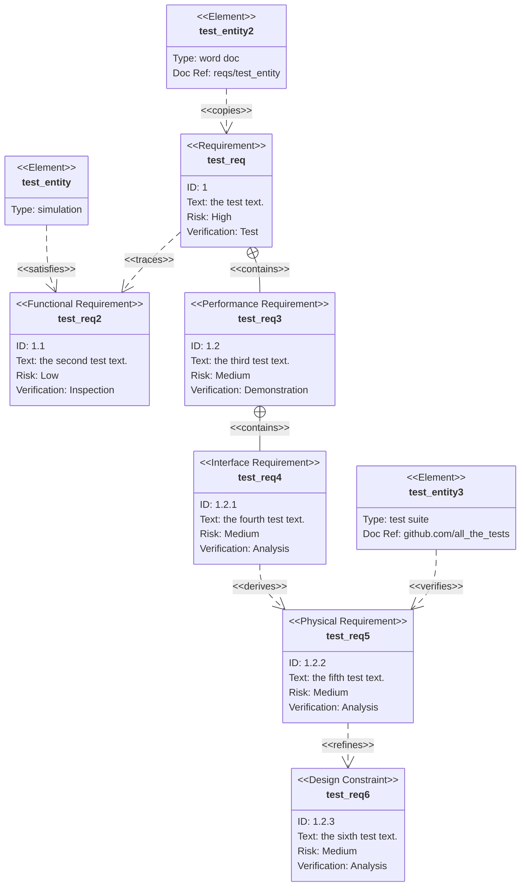

# NLP Task Description

### Diagram Type: Requirements Diagram
### Task: Software Requirements Specification for a Smart Home System
This task involves creating a Requirements Diagram to visually represent and organize the requirements of a smart home system. The diagram will help in defining the necessary functionalities, security measures, and interactions within the system, guiding both development and testing efforts.

## Data
### Explicit Data Description
Imagine we're setting up a smart home system. Here's what we need to make sure everything works smoothly and safely:
1. **User Authentication**: This is crucial. It's the first thing we check to make sure only authorized users can access the system. We'll test this thoroughly because it's a high-risk area.
2. **Device Connectivity**: Once we know a user is authorized, we need to connect their devices. This is also tested and has a medium risk because it relies on the authentication step.
3. **Data Privacy**: Protecting user data is non-negotiable. We test this rigorously because it's a high-risk area, especially right after we verify who's using the system.
4. **Energy Efficiency**: We also look at how the system manages power. It's reviewed for medium risk. Efficient power use helps everything run smoothly and depends on how well the devices connect.
5. **Regulatory Compliance**: Finally, we make sure everything complies with the law. This is high risk and reviewed carefully to ensure we meet all legal standards.

### Raw Data

```csv
Requirement,Type,Risk,VerifyMethod,Dependencies
User Authentication,Functional,High,Test,
Device Connectivity,Functional,Medium,Test,User Authentication
Data Privacy,Security,High,Test,User Authentication
Energy Efficiency,Performance,Medium,Review,Device Connectivity
Regulatory Compliance,Regulatory,High,Review,
```

## Validation & Scoring Criteria

### Expected Result:
- **Structure:** The diagram should clearly display all requirements along with their categorization.
- **Labels:** Each requirement should be clearly labeled with its ID, type, and a brief description.
- **Semantic Accuracy:** The dependencies between requirements and system elements should accurately reflect the design and operational constraints.
- **Completeness:** The diagram should encompass all critical requirements for
  the smart home system.
- **Extra Elements:** Deduct 5 points for each component or connection listed
  in the raw data that does not appear in the generated diagram.
- **Additional Notes:** Use icons or different colors to differentiate between types of requirements (e.g., functional, security).

**Mermaid Example:**



### Scoring Weights:
- **Component Matching:** 40%
- **Syntax Correctness:** 20%
- **Semantic Accuracy:** 30%
- **Completeness:** 10%
- **Extra Elements:** Deduct 5 points for each unnecessary element.

## User-Requested Data Descriptions

### Data Description 1
**Actor:** Systems Architect
"I utilize the Requirements Diagram to outline and integrate all system requirements, ensuring that the smart home system is both functional and secure."

**Clarifying Questions:**
1. "How does the user authentication requirement impact device connectivity?"
2. "What methods are used to ensure data privacy across the network?"
3. "Can the system's energy efficiency requirements adapt to varying device load?"
4. "What specific regulations must the system comply with under regulatory compliance?"
5. "How do we verify that each requirement has been successfully implemented?"

### Data Description 2
**Actor:** Product Manager
"The Requirements Diagram helps me to ensure that all product features align with market needs and compliance standards, facilitating effective product development and marketing strategies."

**Clarifying Questions:**
1. "Which requirements are critical for the initial product launch?"
2. "How are changes in regulatory standards reflected in the requirements diagram?"
3. "What are the key performance indicators for energy efficiency?"
4. "How do we prioritize requirements based on risk and impact?"
5. "What are the challenges in balancing functionality and security?"

### Data Description 3
**Actor:** Quality Assurance Lead
"I refer to the Requirements Diagram to design comprehensive test plans that cover all aspects of functionality, performance, and security."

**Clarifying Questions:**
1. "What are the specific test cases for verifying user authentication mechanisms?"
2. "How do we test for device connectivity under different network conditions?"
3. "What are the best practices for testing data encryption and privacy safeguards?"
4. "How do we measure and report on energy efficiency during testing?"
5. "What documentation is required to prove compliance with regulatory standards?"

This Requirements Diagram task description provides a structured visualization of the system requirements for a smart home system, aiding in the precise alignment of development, testing, and compliance efforts.
