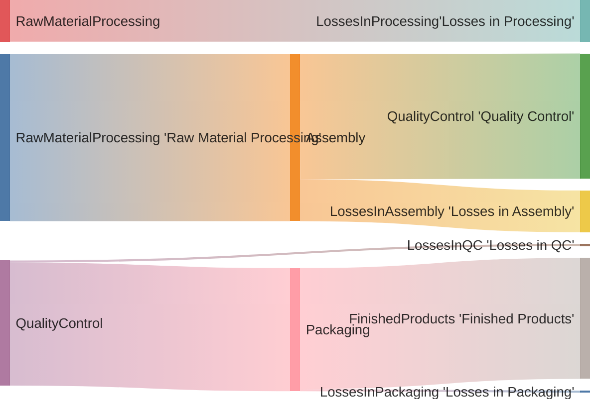

# NLP Task Description

### Diagram Type: Sankey Diagram
### Task: Energy Flow Analysis in Manufacturing Process
This task involves creating a Sankey diagram to visualize energy flows in a manufacturing process, helping stakeholders understand energy consumption and identify areas for optimization.

## Data
### Explicit Data Description
The Sankey diagram will detail the energy flow in a manufacturing process as follows: Raw Material Processing to Assembly uses 800 units, Raw Material Processing to Losses in Processing uses 200 units, Assembly to Quality Control uses 600 units, Assembly to Losses in Assembly uses 200 units, Quality Control to Packaging uses 590 units, Quality Control to Losses in QC uses 10 units, Packaging to Finished Products uses 580 units, and Packaging to Losses in Packaging uses 10 units.

### Raw Data

```csv
RawMaterialProcessing,Assembly,800
RawMaterialProcessing,LossesInProcessing,200
Assembly,QualityControl,600
Assembly,LossesInAssembly,200
QualityControl,Packaging,590
QualityControl,LossesInQC,10
Packaging,FinishedProducts,580
Packaging,LossesInPackaging,10
```

## Validation & Scoring Criteria

### Expected Result:
- **Structure:** The Sankey diagram should illustrate the flow of energy from raw material processing to finished products, with appropriate intermediate stages and energy losses.
- **Labels:** Each stage should be labeled clearly to indicate the process step and associated energy consumption.
- **Semantic Accuracy:** The widths of the flow lines should accurately represent the magnitude of energy consumption at each stage.
- **Completeness:** All significant process stages and energy losses should be
  included in the diagram.
- **Extra Elements:** Deduct 5 points for each component or connection listed
  in the raw data that does not appear in the generated diagram.
- **Additional Notes:** The diagram should be visually appealing and easy to interpret, enhancing stakeholders' understanding of energy usage in the manufacturing process.

**Mermaid Example:**



### Scoring Weights:
- **Component Matching:** 40%
- **Syntax Correctness:** 20%
- **Semantic Accuracy:** 30%
- **Completeness:** 10%
- **Extra Elements:** Deduct 5 points for each unnecessary element.

## User Requested Data Descriptions

### Data Description 1
**Actor:**  Manufacturing Engineer

The manufacturing engineer requires a detailed breakdown of energy consumption at each stage of the manufacturing process, including any losses incurred. This information will help optimize energy usage and improve efficiency.

**Clarifying Questions:**

1. Can you provide specific examples of energy consumption at different process stages?
2. Are there any additional details needed to accurately represent energy flows in the diagram?
3. How should we handle cases where energy losses occur between process stages?
4. Is there a preferred format or style for labeling stages and energy flows in the diagram?
5. Are there any specific metrics or units of measurement we should consider for energy consumption?

### Data Description 2
**Actor:**  Production Manager

The production manager seeks a visual representation of energy usage throughout the manufacturing process to identify potential areas for cost reduction and resource optimization.

**Clarifying Questions:**

1. Can you provide insights into the significance of energy consumption at different stages for production efficiency?
2. Are there any specific energy-saving initiatives or goals we should consider when creating the diagram?
3. How frequently do energy consumption patterns change in the manufacturing process?
4. Is there a preference for depicting absolute energy values or relative proportions in the diagram?
5. Are there any specific areas of interest or concern regarding energy usage that we should focus on?

### Data Description 3
**Actor:**  Sustainability Officer

The sustainability officer aims to visualize energy flows in the manufacturing process to assess the environmental impact and identify opportunities for sustainable practices.

**Clarifying Questions:**

1. Can you provide information on the source of energy used in the manufacturing process (e.g., renewable vs. non-renewable)?
2. Are there any environmental regulations or sustainability targets that should be considered in the analysis?
3. How do energy consumption patterns align with overall sustainability goals for the organization?
4. Are there any specific areas where reducing energy consumption could have a significant environmental benefit?
5. Is there a preference for including additional environmental metrics (e.g., carbon emissions) in the diagram?

### Data Description 4
**Actor:**  Financial Analyst

The financial analyst requires insights into energy costs associated with each stage of the manufacturing process to assess cost drivers and identify opportunities for cost optimization.

**Clarifying Questions:**

1. Can you provide historical data on energy costs for different process stages?
2. Are there any cost-saving initiatives or budget constraints that should be considered in the analysis?
3. How do fluctuations in energy prices impact overall production costs?
4. Is there a preference for depicting energy costs in absolute terms or relative proportions in the diagram?
5. Are there any specific cost allocation methods or financial metrics we should consider when analyzing energy costs?

### Data Description 5
**Actor:**  Environmental Compliance Officer

The environmental compliance officer requires a comprehensive overview of energy consumption and waste generation in the manufacturing process to ensure compliance with environmental regulations and standards.

**Clarifying Questions:**

1. Can you provide information on waste generation and disposal practices associated with each process stage?
2. Are there any specific environmental regulations or compliance requirements that should be considered in the analysis?
3. How do energy consumption patterns correlate with waste generation in the manufacturing process?
4. Is there a preference for including additional environmental impact indicators (e.g., water usage) in the diagram?
5. Are there any specific environmental certifications or standards the organization aims to comply with?
