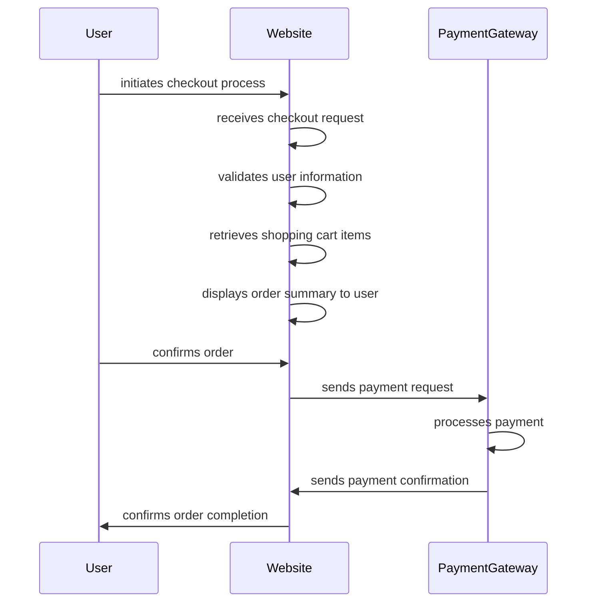

# NLP Task Description

### Diagram Type: Sequence Diagram
### Task: Online Shopping Checkout Process
This task involves creating a sequence diagram to visualize the interactions between various components during the online shopping checkout process, helping stakeholders understand the flow of actions and communications.

## Data
### Explicit Data Description
The sequence diagram will detail the following interactions during the online shopping checkout process: User initiates checkout process, Website receives checkout request, Website validates user information, Website retrieves shopping cart items, Website displays order summary to user, User confirms order, Website sends payment request to PaymentGateway, PaymentGateway processes payment, PaymentGateway sends payment confirmation to Website, Website confirms order completion to user. Each interaction is a direct communication between the User, Website, and PaymentGateway, clearly showing the flow of the checkout process.

### Raw Data

```csv
User,Website,PaymentGateway
User initiates checkout process,
,Website receives checkout request,
,Website validates user information,
,Website retrieves shopping cart items,
,Website displays order summary to user,
User confirms order,
,Website sends payment request to PaymentGateway,
,PaymentGateway processes payment,
,PaymentGateway sends payment confirmation to Website,
,Website confirms order completion to user,
```

## Validation & Scoring Criteria

### Expected Result:
- **Structure:** The sequence diagram should illustrate the chronological sequence of interactions between the user, website, and payment gateway components during the checkout process.
- **Labels:** Each interaction should be labeled clearly to indicate the action performed and the component involved.
- **Semantic Accuracy:** The sequence of events and interactions should accurately represent the actual flow of the checkout process.
- **Completeness:** All significant interactions and system responses should be
  included in the diagram.
- **Extra Elements:** Deduct 5 points for each component or connection listed
  in the raw data that does not appear in the generated diagram.
- **Additional Notes:** The diagram should be easy to follow and should highlight any potential bottlenecks or points of failure in the checkout process.

**Mermaid Example:**



### Scoring Weights:
- **Component Matching:** 40%
- **Syntax Correctness:** 20%
- **Semantic Accuracy:** 30%
- **Completeness:** 10%
- **Extra Elements:** Deduct 5 points for each unnecessary element.

## User Requested Data Descriptions

### Data Description 1
**Actor:**  E-commerce Customer

The e-commerce customer requires a detailed understanding of the online shopping checkout process to ensure a smooth and efficient transaction experience.

**Clarifying Questions:**

1. Can you provide insights into any specific user actions or inputs required during the checkout process?
2. Are there any error handling mechanisms or alternative paths that should be considered in the sequence diagram?
3. How are shipping and billing addresses handled during the checkout process?
4. Are there any third-party services or integrations involved in processing payments or order confirmations?
5. Is there a preferred format or style for representing user interactions and system responses in the diagram?

### Data Description 2
**Actor:**  Website Developer

The website developer seeks a visual representation of the checkout process sequence to guide the implementation of backend logic and frontend user interfaces.

**Clarifying Questions:**

1. Can you provide details on the specific API endpoints or backend functions involved in processing checkout requests?
2. Are there any security considerations or authentication mechanisms that should be incorporated into the sequence diagram?
3. How are session management and user authentication handled during the checkout process?
4. Are there any performance optimization strategies or caching mechanisms that should be considered in the implementation?
5. Is there a preference for depicting synchronous or asynchronous interactions between components in the sequence diagram?

### Data Description 3
**Actor:**  Payment Gateway Provider

The payment gateway provider requires a visualization of the checkout process sequence to ensure seamless integration with e-commerce websites and secure payment processing.

**Clarifying Questions:**

1. Can you provide details on the specific payment methods supported and the corresponding API endpoints for processing payments?
2. Are there any compliance requirements or security standards that should be considered in the payment processing flow?
3. How are transaction statuses and payment confirmations communicated between the payment gateway and e-commerce websites?
4. Are there any additional validation steps or fraud detection mechanisms that should be depicted in the sequence diagram?
5. Is there a preference for representing payment processing events in real-time or batch processing mode?

### Data Description 4
**Actor:**  Quality Assurance Analyst

The quality assurance analyst aims to validate the accuracy and completeness of the checkout process sequence to ensure that all system interactions and user actions are properly accounted for.

**Clarifying Questions:**

1. Can you provide details on the expected behavior and outcomes for each interaction depicted in the sequence diagram?
2. Are there any edge cases or exceptional scenarios that should be included in the validation testing?
3. How are errors and exceptions handled during the checkout process, and how should they be represented in the sequence diagram?
4. Are there any performance metrics or benchmarks that should be considered in evaluating the efficiency of the checkout process?
5. Is there a preference for conducting manual or automated testing of the sequence diagram against the actual system implementation?

### Data Description 5
**Actor:**  Business Stakeholder

The business stakeholder seeks a high-level overview of the checkout process sequence to understand the key stages and dependencies involved in facilitating online transactions.

**Clarifying Questions:**

1. Can you provide insights into the business objectives or KPIs associated with the checkout process?
2. Are there any regulatory or compliance requirements that should be reflected in the sequence diagram?
3. How are customer interactions and feedback captured and integrated into the checkout process flow?
4. Are there any performance analytics or monitoring tools used to track the efficiency and effectiveness of the checkout process?
5. Is there a preference for depicting the checkout process sequence in a specific format or layout for presentation purposes?
