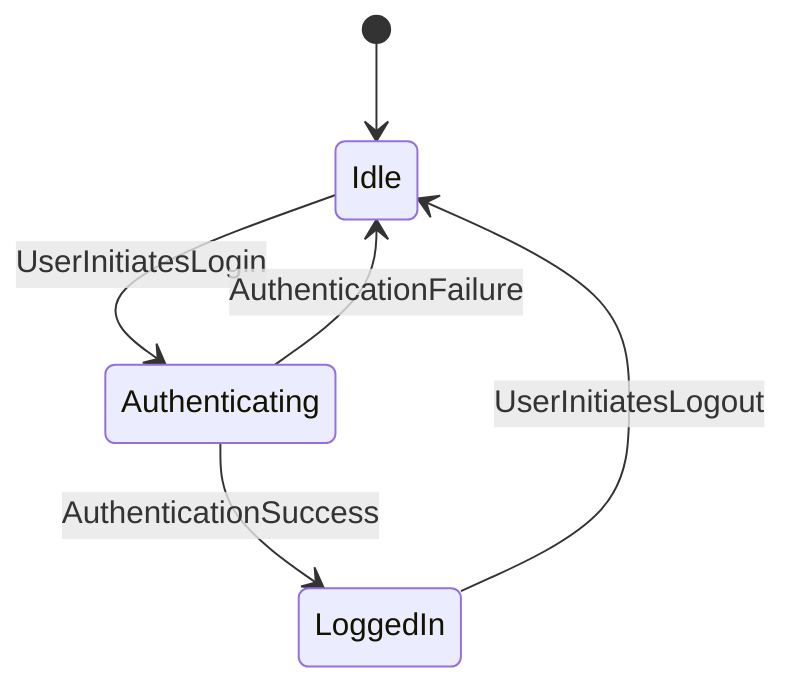

# NLP Task Description

### Diagram Type: State Diagram
### Task: User Authentication State Machine
This task involves creating a state diagram to visualize the various states and transitions involved in the user authentication process, helping stakeholders understand the flow of authentication states and transitions.

## Data
### Explicit Data Description
The state diagram will represent the user authentication process with the following states and transitions: Starting from an 'Idle' state, a 'UserInitiatesLogin' event transitions the system to 'Authenticating'. From 'Authenticating', the system can either transition to 'LoggedIn' upon 'AuthenticationSuccess' or return to 'Idle' on 'AuthenticationFailure'. From 'LoggedIn', a 'UserInitiatesLogout' event will transition the system back to 'Idle'.

### Raw Data

```csv
State,Event,NextState
Idle,UserInitiatesLogin,Authenticating
Authenticating,AuthenticationSuccess,LoggedIn
Authenticating,AuthenticationFailure,Idle
LoggedIn,UserInitiatesLogout,Idle
```

## Validation & Scoring Criteria

### Expected Result:
- **Structure:** The state diagram should illustrate the various states and transitions involved in the user authentication process, including initial, intermediate, and final states.
- **Labels:** Each state and transition should be labeled clearly to indicate the state name, event triggering the transition, and the next state.
- **Semantic Accuracy:** The state transitions should accurately represent the actual flow of the user authentication process.
- **Completeness:** All significant states and transitions should be included
  in the diagram, covering both successful and failed authentication scenarios.
- **Extra Elements:** Deduct 5 points for each component or connection listed
  in the raw data that does not appear in the generated diagram.
- **Additional Notes:** The diagram should be easy to follow and should highlight any potential error states or exceptional scenarios in the authentication process.

**Mermaid Example:**



### Scoring Weights:
- **Component Matching:** 40%
- **Syntax Correctness:** 20%
- **Semantic Accuracy:** 30%
- **Completeness:** 10%
- **Extra Elements:** Deduct 5 points for each unnecessary element.

## User Requested Data Descriptions

### Data Description 1
**Actor:**  Application User

The application user requires a clear understanding of the various states and transitions involved in the user authentication process to navigate the application effectively.

**Clarifying Questions:**

1. Can you provide insights into any specific user actions or events triggering state transitions in the authentication process?
2. Are there any error handling mechanisms or alternative paths that should be considered in the state diagram?
3. How are session management and user authentication handled during the authentication process?
4. Are there any third-party services or integrations involved in the authentication flow?
5. Is there a preferred format or style for representing states and transitions in the diagram?

### Data Description 2
**Actor:**  System Administrator

The system administrator seeks a visual representation of the user authentication state machine to guide the configuration and management of authentication policies and procedures.

**Clarifying Questions:**

1. Can you provide details on the specific authentication mechanisms or protocols used in the state machine?
2. Are there any security considerations or access control policies that should be incorporated into the state diagram?
3. How are user roles and permissions managed during the authentication process?
4. Are there any performance optimization strategies or caching mechanisms that should be considered in the implementation?
5. Is there a preference for depicting synchronous or asynchronous state transitions in the diagram?

### Data Description 3
**Actor:**  Application Developer

The application developer aims to validate the accuracy and completeness of the user authentication state machine to ensure that all states and transitions are properly accounted for in the system implementation.

**Clarifying Questions:**

1. Can you provide details on the expected behavior and outcomes for each state and transition depicted in the state diagram?
2. Are there any edge cases or exceptional scenarios that should be included in the validation testing?
3. How are errors and exceptions handled during the authentication process, and how should they be represented in the state diagram?
4. Are there any performance metrics or benchmarks that should be considered in evaluating the efficiency of the authentication process?
5. Is there a preference for conducting manual or automated testing of the state diagram against the actual system implementation?

### Data Description 4
**Actor:**  Quality Assurance Analyst

The quality assurance analyst aims to validate the accuracy and completeness of the user authentication state machine to ensure that all system interactions and user actions are properly accounted for.

**Clarifying Questions:**

1. Can you provide details on the expected behavior and outcomes for each state and transition depicted in the state diagram?
2. Are there any edge cases or exceptional scenarios that should be included in the validation testing?
3. How are errors and exceptions handled during the authentication process, and how should they be represented in the state diagram?
4. Are there any performance metrics or benchmarks that should be considered in evaluating the efficiency of the authentication process?
5. Is there a preference for conducting manual or automated testing of the state diagram against the actual system implementation?

### Data Description 5
**

Actor:**  Business Stakeholder

The business stakeholder seeks a high-level overview of the user authentication state machine to understand the key states and transitions involved in the authentication process flow.

**Clarifying Questions:**

1. Can you provide insights into the business objectives or KPIs associated with the user authentication process?
2. Are there any regulatory or compliance requirements that should be reflected in the state diagram?
3. How are user authentication trends and metrics monitored and analyzed to optimize the authentication process?
4. Are there any third-party services or integrations involved in the authentication flow?
5. Is there a preference for depicting the state machine in a specific format or layout for presentation purposes?
