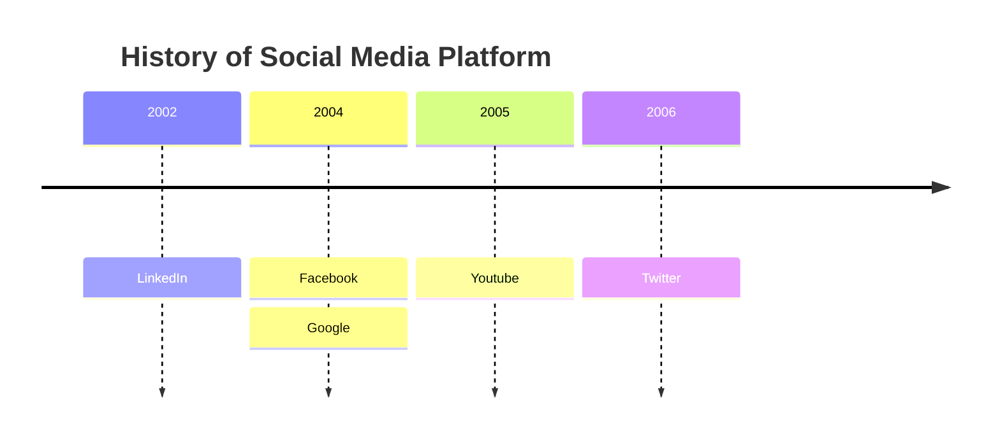

# NLP Task Description

### Diagram Type: Timeline Diagram
### Task: History of Social Media Platform
This task involves creating a timeline diagram to visualize the history of social media platforms, including key events and the founding years of prominent platforms, to provide a chronological overview of their development.

## Data
### Explicit Data Description
The timeline will detail the founding years of major social media platforms with additional historical context as follows: LinkedIn in 2002, Facebook and Google in 2004, YouTube in 2005, and Twitter in 2006. Each platform's entry on the timeline will correspond to its launch year, providing a chronological overview of when each platform was established. It will include significant milestones and events that influenced the growth and popularity of these platforms.

### Raw Data

```csv

Year,Event
2002,LinkedIn
2004,Facebook
2004,Google
2005,Youtube
2006,Twitter

```

## Validation & Scoring Criteria

### Expected Result:
- **Structure:** Timeline depicting the founding years of social media platforms.
- **Labels:** Years and corresponding platform names.
- **Semantic Accuracy:** Correct representation of platform founding years and chronological order.
- **Completeness:** Includes all major social media platforms and their
  founding years.
- **Extra Elements:** Deduct 5 points for each component or connection listed
  in the raw data that does not appear in the generated diagram.
- **Additional Notes:** Platforms may have been founded in the same year.


**Mermaid Example:**



### Scoring Weights:
- **Component Matching:** 40%
- **Syntax Correctness:** 20%
- **Semantic Accuracy:** 30%
- **Completeness:** 10%
- **Extra Elements:** Deduct 5 points for each unnecessary element.

## User Requested Data Descriptions

### Data Description 1
**Actor:**  Social Media Analyst

The social media analyst requires a timeline diagram to visualize the history of social media platforms and their founding years for research and analysis purposes.

**Clarifying Questions:**

1. Are there any specific social media platforms or events that should be highlighted in the timeline diagram?
2. How far back in history should the timeline span? Are there any specific time periods of interest?
3. Is there a preference for the level of detail in the timeline diagram, such as including additional information or annotations?
4. How will the timeline diagram be used in the analysis process? Are there any specific insights or conclusions expected from it?
5. Are there any additional requirements or preferences for the design or layout of the timeline diagram?

### Data Description 2
**Actor:**  Marketing Manager

The marketing manager seeks a timeline diagram to understand the evolution of social media platforms and their impact on marketing strategies over time.

**Clarifying Questions:**

1. Are there any key milestones or developments in social media history that are particularly relevant to marketing initiatives?
2. How will the timeline diagram be utilized in marketing planning or strategy discussions?
3. Are there any specific marketing campaigns or trends that should be reflected in the timeline diagram?
4. How frequently will the timeline diagram be updated to incorporate new developments or changes in the social media landscape?
5. Is there a preference for visual elements or annotations to enhance the clarity and comprehensibility of the timeline diagram?

### Data Description 3
**Actor:**  Technology Enthusiast

The technology enthusiast requires a timeline diagram to explore the chronological evolution of social media platforms and technological advancements in the digital landscape.

**Clarifying Questions:**

1. Are there any specific technological innovations or breakthroughs that should be included in the timeline diagram alongside social media platform developments?
2. How will the timeline diagram be accessed or viewed? Is there a preference for interactive features or multimedia content?
3. Are there any emerging technologies or trends that should be considered in the context of social media platform evolution?
4. How will the timeline diagram be used to educate or inform others about the history of social media platforms and technology?
5. Are there any accessibility requirements or considerations for the design and presentation of the timeline diagram?

### Data Description 4
**Actor:**  Educator

The educator seeks a timeline diagram to illustrate the historical timeline of social media platforms for educational purposes in classrooms or online courses.

**Clarifying Questions:**

1. Are there any specific educational objectives or learning outcomes associated with the timeline diagram?
2. How will the timeline diagram be integrated into the educational curriculum or lesson plans?
3. Are there any specific pedagogical approaches or instructional strategies that should be incorporated into the timeline diagram?
4. How will students engage with the timeline diagram? Are there any interactive elements or activities planned?
5. Are there any preferences or guidelines for the level of detail or complexity in the timeline diagram to suit the target audience and educational context?

### Data Description 5
**Actor:**  Social Media Historian

The social media historian requires a timeline diagram to document and preserve the history of social media platforms for archival and research purposes.

**Clarifying Questions:**

1. Are there any archival sources or historical documents that should be consulted to ensure accuracy and completeness in the timeline diagram?
2. How will the timeline diagram be archived or preserved for future reference and research?
3. Are there any specific criteria or standards for selecting and categorizing social media platforms in the timeline diagram?
4. How will the timeline diagram contribute to ongoing research or scholarship in the field of social media history?
5. Are there any copyright or intellectual property considerations related to the content included in the timeline diagram?
