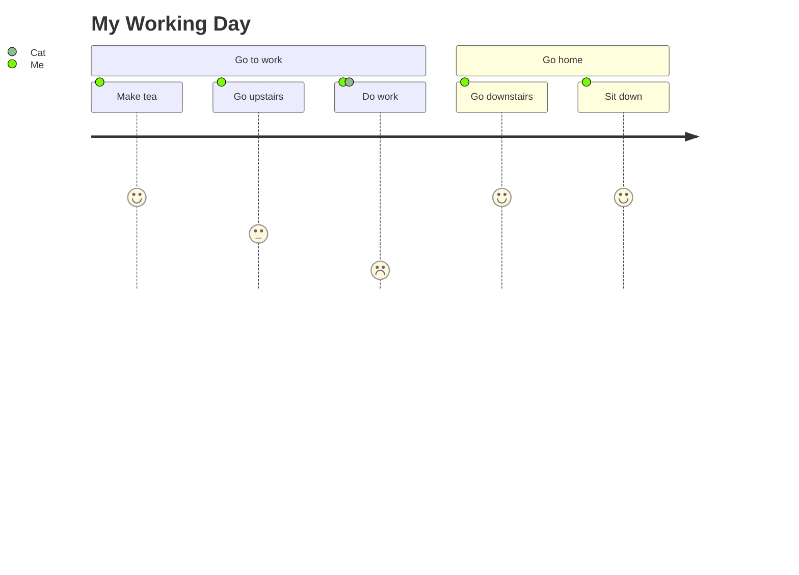

# NLP Task Description

### Diagram Type: User Journey Diagram
### Task: My Working Day
This task involves creating a user journey diagram to visualize the various activities and steps involved in a typical working day, including both work-related tasks and transitions between different locations or activities.

## Data
### Explicit Data Description
The user journey diagram will detail the following activities and transitions during a working day: Making tea for 5 minutes, going upstairs taking 3 minutes, working for 1 hour with the cat around, going downstairs taking 5 minutes, and sitting down for 5 minutes. Each activity includes the main actor, "Me", and for the work activity, the cat is also involved.

### Raw Data

```csv

Section,Activity,Duration,Actors
Go to work,Make tea,5,Me
Go to work,Go upstairs,3,Me
Go to work,Do work,1,Me;Cat
Go home,Go downstairs,5,Me
Go home,Sit down,5,Me

```

## Validation & Scoring Criteria

### Expected Result:
- **Structure:** User journey diagram depicting the sequence of activities and transitions during a working day.
- **Labels:** Sections, activities, durations, and actors involved in each step.
- **Semantic Accuracy:** Correct representation of the user's journey and activities performed.
- **Completeness:** Includes all significant activities and transitions
  relevant to the working day.
- **Extra Elements:** Deduct 5 points for each component or connection listed
  in the raw data that does not appear in the generated diagram.
- **Additional Notes:** Durations may vary based on individual preferences and circumstances.

**Mermaid Example:**



### Scoring Weights:
- **Component Matching:** 40%
- **Syntax Correctness:** 20%
- **Semantic Accuracy:** 30%
- **Completeness:** 10%
- **Extra Elements:** Deduct 5 points for each unnecessary element.

## User Requested Data Descriptions

### Data Description 1
**Actor:**  Office Worker

The office worker requires a user journey diagram to visualize the sequence of activities and transitions during a typical working day, including commuting to work, performing tasks, and returning home.

**Clarifying Questions:**

1. Are there any specific tasks or activities that should be included in the user journey diagram for the working day?
2. How long does each activity typically last? Are there any variations or exceptions to consider?
3. Who are the primary actors or participants involved in the different sections of the user journey?
4. How frequently does the user journey occur? Is it a daily routine or occasional occurrence?
5. Are there any preferences or requirements for the design or presentation of the user journey diagram to enhance clarity and comprehension?

### Data Description 2
**Actor:**  Remote Worker

The remote worker seeks a user journey diagram to illustrate the flow of activities and transitions throughout a typical work-from-home day, including remote work tasks and breaks.

**Clarifying Questions:**

1. How does the user typically start and end their remote work day? Are there any specific routines or rituals involved?
2. Are there any distinct sections or phases within the user journey, such as morning preparation, focused work sessions, or afternoon relaxation?
3. What tools or technologies does the user utilize during different activities or tasks throughout the day?
4. How does the user manage transitions between work-related tasks and personal activities during the day?
5. Are there any productivity or efficiency goals associated with the user journey that should be reflected in the diagram?

### Data Description 3
**Actor:**  Freelancer

The freelancer requires a user journey diagram to map out their daily workflow and activities, including client interactions, project work, and personal time.

**Clarifying Questions:**

1. Are there any specific milestones or checkpoints in the user journey that mark the completion of significant tasks or project milestones?
2. How does the user prioritize and allocate time for different activities or projects throughout the day?
3. Are there any recurring patterns or routines in the user's daily workflow that should be represented in the diagram?
4. How does the user balance work-related commitments with personal activities or leisure time during the day?
5. Are there any dependencies or dependencies between different activities or tasks in the user journey that should be highlighted in the diagram?

### Data Description 4
**Actor:**  Student

The student seeks a user journey diagram to visualize their daily schedule and activities, including attending classes, studying, and recreational breaks.

**Clarifying Questions:**

1. How does the student's daily routine vary on weekdays versus weekends or holidays?
2. Are there any extracurricular activities or commitments that should be included in the user journey diagram?
3. How does the user manage time between academic responsibilities, social interactions, and personal hobbies or interests?
4. Are there any specific study techniques or strategies that the user employs during study sessions or exam preparation?
5. Are there any preferences or preferences for the layout or format of the user journey diagram to facilitate easy comprehension and navigation?

### Data Description 5
**Actor:**  Commuter

The commuter requires a user journey diagram to visualize their daily commute to and from work or school, including modes of transportation and key transit points.

**Clarifying Questions:**

1. What modes of transportation does the user typically use during their daily commute, such as public transit, car, bicycle, or walking?
2. Are there any specific landmarks or points of interest along the commute route that should be included in the user journey diagram?
3. How long does the user's commute typically last, and are there any variations or delays to consider?
4. How does the user navigate transit transfers or connections during their commute, and are there any preferred routes or shortcuts?
5. Are there any safety or accessibility considerations related to the user's commute that should be addressed in the diagram?
