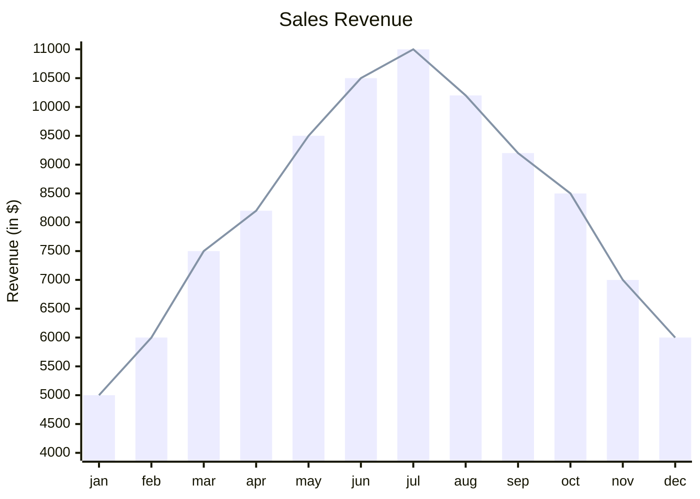

# NLP Task Description

### Diagram Type: XY Chart
### Task: Sales Revenue Analysis
This task involves creating an XY chart to visualize the sales revenue over the course of a year, with monthly data points representing the revenue generated.

## Data
### Explicit Data Description
The XY chart will display sales revenue data for each month of the year. Specifically, it will show: January with $5000, February with $6000, March with $7500, April with $8200, May with $9500, June with $10500, July with $11000, August with $10200, September with $9200, October with $8500, November with $7000, and December with $6000.

### Raw Data

```csv

Month,Sales Revenue
Jan,5000
Feb,6000
Mar,7500
Apr,8200
May,9500
Jun,10500
Jul,11000
Aug,10200
Sep,9200
Oct,8500
Nov,7000
Dec,6000

```

## Validation & Scoring Criteria

### Expected Result:
- **Structure:** XY chart depicting the monthly sales revenue over the course of the year.
- **Labels:** Months on the x-axis and sales revenue (in $) on the y-axis.
- **Semantic Accuracy:** Correct representation of the sales revenue data for each month.
- **Completeness:** Includes all 12 months of the year with corresponding
  revenue figures.
- **Extra Elements:** Deduct 5 points for each component or connection listed
  in the raw data that does not appear in the generated diagram.
- **Additional Notes:** The chart may include both bar and line representations for the sales revenue data.

**Mermaid Example:**



### Scoring Weights:
- **Component Matching:** 40%
- **Syntax Correctness:** 20%
- **Semantic Accuracy:** 30%
- **Completeness:** 10%
- **Extra Elements:** Deduct 5 points for each unnecessary element.

## User Requested Data Descriptions

### Data Description 1
**Actor:**  Sales Manager

The sales manager requires an XY chart to visualize the monthly sales revenue for the past year, allowing for better analysis and decision-making regarding sales performance.

**Clarifying Questions:**

1. Are there any specific trends or patterns in the sales revenue data that should be highlighted in the chart?
2. How should the chart represent the sales revenue data for each month—using bars, lines, or both?
3. Are there any significant events or factors that may have influenced sales performance during certain months?
4. Is there a preferred range or scale for the y-axis to ensure optimal visualization of the sales revenue data?
5. Are there any additional data points or annotations that should be included in the chart to provide context or insights into the sales revenue trends?

### Data Description 2
**Actor:**  Financial Analyst

The financial analyst seeks an XY chart to analyze the monthly sales revenue trends and identify any deviations or anomalies that may require further investigation or analysis.

**Clarifying Questions:**

1. How should the XY chart visually represent the sales revenue data to facilitate analysis and interpretation?
2. Are there any specific metrics or KPIs related to sales performance that should be incorporated into the chart?
3. How does the sales revenue data correlate with other financial metrics or business indicators that may impact revenue generation?
4. Are there any external factors or market conditions that may have influenced sales revenue fluctuations during certain months?
5. Are there any data visualization preferences or requirements that should be considered when creating the XY chart for the financial analysis?

### Data Description 3
**Actor:**  Marketing Manager

The marketing manager requires an XY chart to assess the effectiveness of marketing campaigns and initiatives on sales revenue generation, with monthly data points for performance evaluation.

**Clarifying Questions:**

1. How should the XY chart visualize the relationship between marketing activities and sales revenue over the past year?
2. Are there any specific marketing campaigns or promotions that should be linked to sales revenue data in the chart?
3. How does the marketing manager intend to use the XY chart for evaluating the ROI of marketing efforts and optimizing future strategies?
4. Are there any key performance indicators or benchmarks that the marketing manager wants to track alongside sales revenue in the chart?
5. Are there any additional data sources or insights that should be integrated into the XY chart to provide a comprehensive view of marketing impact on sales revenue?

### Data Description 4
**Actor:**  CEO

The CEO requires an XY chart to gain insights into the overall sales performance and revenue trends of the company over the past year, supporting strategic decision-making and planning.

**Clarifying Questions:**

1. How should the XY chart visually represent the sales revenue data to provide actionable insights for strategic decision-making?
2. Are there any specific metrics or key performance indicators that the CEO wants to track alongside sales revenue in the chart?
3. How does the CEO intend to use the XY chart to evaluate the company's financial performance and identify areas for improvement or growth?
4. Are there any external factors or market trends that may have influenced sales revenue fluctuations during certain months?
5. Are there any additional data points or annotations that should be included in the XY chart to provide context or insights into the company's sales performance and revenue trends?

### Data Description 5
**Actor:**  Business Analyst

The business analyst requires an XY chart to analyze the seasonality and cyclical patterns in the company's sales revenue data, identifying recurring trends and forecasting future performance.

**Clarifying Questions:**

1. How should the XY chart visualize the seasonality and cyclical patterns in the sales revenue data over the past year?
2. Are there any specific statistical methods or techniques that the business analyst wants to apply to the sales revenue analysis using the XY chart?
3. How does the business analyst plan to use the XY chart for forecasting future sales revenue and predicting potential revenue trends?
4. Are there any historical data points or trends that the business analyst wants to highlight or emphasize in the chart for trend analysis?
5. Are there any data visualization preferences or requirements that should be considered when creating the XY chart for the sales revenue analysis?
