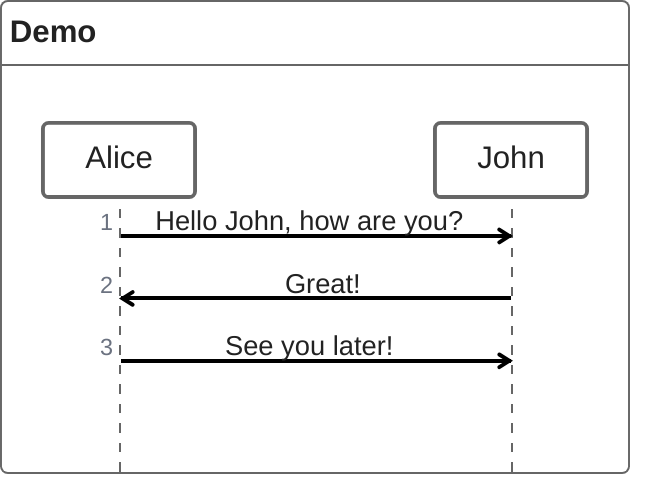

# NLP Task Description

### Diagram Type: ZenUML
### Task: Communication Flow
This task involves creating a communication flow diagram using ZenUML to illustrate a conversation between multiple individuals.

## Data
### Explicit Data Description
The ZenUML diagram will detail the following conversation between Alice and John: Alice initiates the conversation with "Hello John, how are you?", John responds with "Great!", and Alice concludes with "See you later!". Each message is a direct communication between Alice and John, clearly showing the flow of the conversation.

### Raw Data

```csv

Alice->John: Hello John, how are you?
John->Alice: Great!
Alice->John: See you later!

```

## Validation & Scoring Criteria

### Expected Result:
- **Structure:** ZenUML diagram depicting the communication flow between multiple individuals.
- **Labels:** Messages exchanged between individuals should be appropriately labeled.
- **Semantic Accuracy:** Correct representation of the conversation flow as per the raw data.
- **Completeness:** All messages exchanged between individuals should be
  included in the diagram.
- **Extra Elements:** Deduct 5 points for each component or connection listed
  in the raw data that does not appear in the generated diagram.
- **Additional Notes:** The diagram should clearly illustrate the sequence of messages and the direction of communication.

**Mermaid Example:**



### Scoring Weights:
- **Component Matching:** 40%
- **Syntax Correctness:** 20%
- **Semantic Accuracy:** 30%
- **Completeness:** 10%
- **Extra Elements:** Deduct 5 points for each unnecessary element.

## User Requested Data Descriptions

### Data Description 1
**Actor:**  Alice

Alice requests a ZenUML diagram to visualize a conversation with John, including greetings and farewells.

**Clarifying Questions:**

1. Is there any specific formatting or styling preference for the ZenUML diagram?
2. Should the diagram include additional annotations or labels to provide context for the conversation?
3. Are there any other individuals involved in the conversation besides Alice and John?
4. How should the messages be structured and labeled in the ZenUML diagram to accurately represent the conversation flow?
5. Are there any particular aspects of the conversation that should be highlighted or emphasized in the diagram?

### Data Description 2
**Actor:**  John

John requests a ZenUML diagram to illustrate a conversation with Alice, focusing on the exchange of greetings and responses.

**Clarifying Questions:**

1. Are there any specific visual elements or symbols that should be incorporated into the ZenUML diagram?
2. Should the diagram include timestamps or other metadata for each message exchanged?
3. How does John intend to use the ZenUML diagram for communication or documentation purposes?
4. Are there any particular communication patterns or sequences that should be highlighted in the diagram?
5. Are there any additional requirements or preferences for the layout and presentation of the ZenUML diagram?

### Data Description 3
**Actor:**  Bob

Bob requests a ZenUML diagram to visualize a conversation involving multiple participants, with a focus on clear communication flow and message sequencing.

**Clarifying Questions:**

1. How many participants are involved in the conversation besides Alice and John?
2. Are there any specific message types or categories that should be differentiated in the ZenUML diagram?
3. Should the diagram include any indications of response times or delays between messages?
4. Are there any specific criteria for evaluating the effectiveness of the communication flow depicted in the diagram?
5. Are there any additional requirements or preferences for the styling or layout of the ZenUML diagram?

### Data Description 4
**Actor:**  Emily

Emily requests a ZenUML diagram to visualize a group discussion, highlighting key interactions and decision points among the participants.

**Clarifying Questions:**

1. How should the ZenUML diagram represent group interactions compared to one-on-one conversations?
2. Are there any specific decision-making processes or outcomes that should be emphasized in the diagram?
3. Should the diagram include any annotations or labels to provide context for the group discussion?
4. Are there any particular communication dynamics or patterns that should be captured in the diagram?
5. Are there any preferences for the visual presentation or layout of the ZenUML diagram?

### Data Description 5
**Actor:**  Sarah

Sarah requests a ZenUML diagram to visualize a team meeting, focusing on the flow of information and action items discussed during the session.

**Clarifying Questions:**

1. How should the ZenUML diagram depict the distribution of tasks or responsibilities among the meeting participants?
2. Are there any specific agenda items or topics that should be represented as separate communication threads in the diagram?
3. Should the diagram include any indications of decision points or outcomes resulting from the meeting discussions?
4. Are there any particular communication protocols or conventions that should be reflected in the diagram?
5. Are there any preferences for the level of detail or granularity in the representation of meeting interactions?
